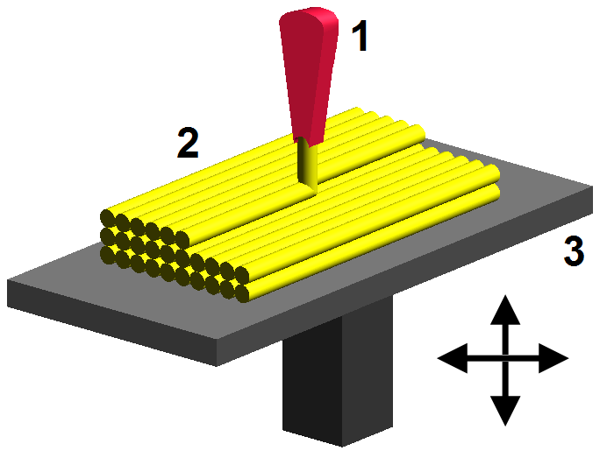

# AE837
## Advanced Mechanics of Damage Tolerance
Dr. Nicholas Smith 
Wichita State University, Department of Aerospace Engineering
August 20, 2019

----
## upcoming schedule

-   Aug 20 - Syllabus, Elasticity Review
-   Aug 22 - Elasticity Review
-   Aug 27 - Griffith Fracture
-   Aug 29 - Griffith Fracture

----
## outline

<!-- vim-markdown-toc GFM -->

* introduction
* syllabus and schedule
* fracture introduction
* elasticity
* coordinate transformation
* examples
* principal values
* invariants
* principal directions
* examples

<!-- vim-markdown-toc -->

---
# introduction

----
## about me

 <!-- .element width="75%" -->

----
## education
  - B.S. in Mechanical Engineering from Brigham Young University
    - Worked with ATK to develop tab-less gripping system for tensile testing composite tow specimens
    - Needed to align the specimen, as well as grip it without causing a stress concentration

----
## education
  - M.S. and Ph.D. from School of Aeronautics and Astronautics at Purdue University
    - Worked with Boeing to simulate mold flows
    - First ever mold simulation with anisotropic viscosity

----
## research

----
## research

----
## research

  

  

  

  <ul>
  <li> Composites are being used in 3D printing now </li>
  <li> Printing patterns are optimized for isotropic materials </li>
  <li> Sometimes composites hurt more than they help when not utilized properly </li>
  

----
## research

	<ul>
		<li>Thermoplastic composites offer many advantages over thermoset</li>
		<li>Production speed, recyclability</li>
		<li>Also have challenges, such as bonding/welding</li>
	</ul>

	

 

----
## classes

-   AE 731 Elasticity Theory (odd years in fall)
-   AE 737 Mechanics of Damage Tolerance (every year in spring)
-   AE 837 Advanced Mechanics of Damage Tolerance (odd years in fall)
-   AE 760AA Micromechanics and Multiscale Modeling (odd years in spring)
-   AE 831 Continuum Mechanics (even years in fall)

----
## introductions

-   Name
-   Student status (Undergrad, Masters, Ph.D)
-   Full time or part time student?
-   One interesting thing to remember you by

---
# syllabus and schedule

----
## course textbook

-   Text is available as a pdf on Blackboard and the [class website](https://ndaman.github.io/fracture/), you may purchase any version if you prefer a hard copy
-   Homework will be given in handouts provided online
-   Supplemental textbooks are listed in the syllabus for further study

----
## office hours

-   I will e-mail everyone in the course a Doodle link we can use to find the optimal office hours
-   Let me know if you do not receive the e-mail, you may need to update your information in Blackboard
-   Take advantage of office hours, this is time that I have already set aside for you
-   If the regular office hours do not work for your schedule, send me an e-mail and we can work out a time to meet

----
## tentative course outline

-   Section 1 - linear elastic fracture mechanics
    -   Elasticity Review (Aug 20-22)
    -   Griffith Fracture (Aug 27-29)
    -   Elastic Stress Field (Sept 3-12)
    -   Exam 1 (Sept 19)

----
## tentative course outline

-   Section 2 - advanced analytical fracture
    -   Energy Approach (Sept 24-26)
    -   Finite Elements (Oct 1-12)
    -   Plasticity (Oct 17-24)
    -   Mixed-Mode Fracture (Oct 29-31)
    -   Exam 2 (Nov 7)

----
## tentative course outline

-   Section 3 - computational fracture
    -   XFEM (Nov 12-14)
    -   Cohesive Zone Modeling (Nov 19-28)
    -   Interfacial Cracks (Dec 3-5)
    -   Final project (due Dec 6)

----
## grades

-   Grade breakdown
    -   Homework 15%
    -   Exam 1 30%
    -   Exam 2 30%
    -   Final Project 25%
-   Follow a traditional grading scale

----
## final project

-   Perform computational fracture analysis on a real-life part (or test specimen) of your choosing
-   Use the principles developed in this class to provide an analytical validation of your computational methods
-   Examples: mixed-mode fracture study, progressive failure, adhesive bond failure, etc.
-   Individual project
-   More discussion after Exam 1

----
## class expectations

-   Consider the cost (to you or others) of your being in class
-   I ask that you refrain from distracting behaviors during class
-   When you have something more important than class to take care of, please take care of it outside of class

----
## software

-   You will be required to do finite element analysis in this class, we have a class kit license for COMSOL, but you are welcome to use any software package you want
-   The student version of Abaqus is also free and has a good XFEM module (not all FEA tools have XFEM)
-   Although we will not use FEA until later in the course, I advise you set up the software as soon as possible

---
# fracture introduction

----
## damage

-   In linear elasticity, we generally consider materials in their pristine state
-   Realities of manufacturing, cyclic loads, and unforeseen loads result in a material which is something other than pristine
-   When stress is uniform, simple analysis can often predict failure (*σ* &gt; *σ**f*)
-   When damage or stress concentrations are present, however, failure is more accurately modeled as fracture

----
## fracture

-   There are two primary approaches to modeling fracture
-   In the first we examine the elastic stress and displacement fields near a crack tip
-   A fracture criterion is then defined based on the so-called stress intensity factor
-   The other approach considers the global energy of a body with a crack
-   We consider the potential energy of a cracked solid and consider its variation with a virtual crack extension
-   The energy release rate is then used to quantify failure

----
## fracture

-   Several other parameters have been used to quantify failure in addition to the stress intensity factor and the energy release rate, with somewhat less success
-   J-integral
-   Crack Tip Opening Displacement
-   Crack Tip Opening Angle

----
## fracture mechanics

-   In fracture mechanics we consider three different modes
-   Mode I is known as the “opening mode”
-   Mode II is known as the “sliding mode”
-   Mode III is known as the “tearing mode”

----
## fracture mechanics

---
# elasticity

----
## linear elasticity

-   We cannot cover everything from elasticity, and you can get by in this course without it, but we will be using many principles from elasticity in this course
-   Some of the things we will review are
    -   Index notation (briefly)
    -   Coordinate transformation
    -   Principal values/directions
    -   Spherical/cylindrical coordinates
    -   Strain energy
    -   General solution strategy

----
## big picture

-   Perhaps more important than the details we will review is to keep in mind the “big picture”
-   To solve any problem in elasticity, we need to satisfy:
    1.  The equilibrium equations (in the appropriate coordinate system)
    2.  The boundary conditions
    3.  Without violating strain compatibility

----
## big picture

-   Most often, we assume a state of plane stress or plane strain and solve the problem in 2D
-   Even “3D” problems (i.e. Mode III fracture) have reduced variables
-   Stress functions are often formulated to automatically satisfy equilibrium, or displacement functions to automatically satisfy compatibility

---
# coordinate transformation

----
## two dimensions

 <!-- .element width="75%" -->

----
## two dimensions

-   The vector, *v*, remains fixed, but we transform our coordinate system
-   In the new coordinate system, the *x*2′ portion of *v* is zero.
-   To transform the coordinate system, we first define some unit vectors.
-   $\\hat{e}\_1$ is a unit vector in the direction of *x*1, while $\\hat{e}\_1^\\prime$ is a unit vector in the direction of *x*1′

----
## two dimensions

 <!-- .element width="75%" -->

----
## two dimensions

-   For this example, let us assume *v* = ⟨2, 2⟩ and *θ* = 45∘
-   We can write the transformed unit vectors, $\\hat{e}\_1^\\prime$ and $\\hat{e}\_2^\\prime$ in terms of $\\hat{e}\_1$, $\\hat{e}\_2$ and the angle of rotation, *θ*.
$$\\begin{aligned}
	\\hat{e}\_1^\\prime &= \\langle \\hat{e}\_1 \\cos \\theta , \\hat{e}\_2 \\sin \\theta\\rangle\\\\
	\\hat{e}\_2^\\prime &= \\langle -\\hat{e}\_1 \\sin \\theta , \\hat{e}\_2 \\cos \\theta \\rangle\\end{aligned}$$

----
## two dimensions

-   We can write the vector, *v*, in terms of the unit vectors describing our axis system
-   $v = v\_1 \\hat{e}\_1 + v\_2 \\hat{e}\_2$
-   (note: $\\hat{e}\_1=\\langle 1, 0 \\rangle$ and $\\hat{e}\_2 = \\langle 0,1 \\rangle$)
-   *v* = ⟨2, 2⟩=2⟨1, 0⟩+2⟨0, 1⟩

----
## two dimensions

-   When expressed in the transformed coordinate system, we refer to *v*′
-   *v*′ = ⟨*v*1cos*θ* + *v*2sin*θ*, −*v*1sin*θ* + *v*2cos*θ*⟩
-   $v^\\prime = \\langle 2\\sqrt{2}, 0 \\rangle$
-   We can recover the original vector from the transformed coordinates:
-   $v = v\_1^\\prime \\hat{e}\_1^\\prime + v\_2^\\prime \\hat{e}\_2^\\prime$
-   (note: $\\hat{e}\_1^\\prime=\\langle \\frac{\\sqrt{2}}{2},\\frac{\\sqrt{2}}{2} \\rangle$ and $\\hat{e}\_2^\\prime = \\langle -\\frac{\\sqrt{2}}{2},\\frac{\\sqrt{2}}{2} \\rangle$)
-   $v = 2\\sqrt{2}\\langle \\frac{\\sqrt{2}}{2},\\frac{\\sqrt{2}}{2} \\rangle, 0 \\langle -\\frac{\\sqrt{2}}{2},\\frac{\\sqrt{2}}{2} \\rangle = \\langle 2, 2 \\rangle$

----
## general

-   Coordinate transformation can become much more complicated in three dimensions, and with higher-order tensors
-   It is convenient to define a general form of the coordinate transformation in index notation
-   We define *Q**ij* as the cosine of the angle between the *x**i*′ axis and the *x**j* axis.
-   This is also referred to as the “direction cosine”
    *Q**ij* = cos(*x**i*′, *x**j*)

----
## general

-   We can use this form on our 2D transformation example

$$\\begin{aligned}
	Q\_{ij} &= \\cos (x\_i^\\prime, x\_j)\\\\ &= \\begin{bmatrix}
	\\cos (x\_1^\\prime, x\_1) & \\cos (x\_1^\\prime, x\_2)\\\\
	\\cos (x\_2^\\prime, x\_1) & \\cos (x\_2^\\prime, x\_2)
\\end{bmatrix}\\\\ &= \\begin{bmatrix}
	\\cos \\theta & \\cos (90-\\theta)\\\\
	\\cos (90+\\theta) & \\cos \\theta
\\end{bmatrix} \\\\ &= \\begin{bmatrix}
	\\cos \\theta & \\sin \\theta \\\\
	-\\sin \\theta & \\cos \\theta
\\end{bmatrix}\\end{aligned}$$

----
## general

-   We can transform any-order tensor using *Q**ij*
-   Vectors (first-order tensors): *v**i*′ = *Q**ij**v**j*
-   Matrices (second-order tensors): *σ**mn*′ = *Q**mi**Q**nj**σ**ij*
-   Fourth-order tensors: *C**ijkl*′ = *Q**im**Q**jn**Q**ko**Q**lp**C**mnop*

----
## general

-   We can similarly use *Q**ij* to find tensors in the original coordinate system
-   Vectors (first-order tensors): *v**i* = *Q**ji**v**j*′
-   Matrices (second-order tensors): *σ**mn* = *Q**im**Q**jn**σ**ij*′
-   Fourth-order tensors: *C**ijkl* = *Q**mi**Q**nj**Q**ok**Q**pl**C**mnop*′

----
## mental/emotional health warning

-		Some texts flip the definition of *Q**ij*, and then flip their transformation law accordingly
-		Any time you use tensor transformation, make sure you are following a consistent set of transformation laws

----
## general

-   We can derive some interesting properties of the transformation tensor, *Q**ij*
-   We know that *v**i* = *Q**ji**v**j*′ and that *v**i*′ = *Q**ij**v**j*
-   If we substitute (changing the appropriate indexes) we find:
-   *v**i* = *Q**ji**Q**jk**v**k*
-   We can now use the Kronecker Delta to substitute *v**i* = *δ**ik**v**k* which gives
-   *δ**ik**v**k* = *Q**ji**Q**jk**v**k*

---
# examples

----
## example

----
## example

 <!-- .element width="50%" --> 

----
## example

<!-- .element width="50%" --> 

----
## example

-   *Q**ij*1 = cos(*x**i*′, *x**j*)
-   *Q**ij*2 = cos(*x**i*′′, *x**j*′)

$$Q\_{ij}^1 = \\begin{bmatrix}
\\cos 60 & \\cos 90 & \\cos 150\\\\
\\cos 90 & \\cos 0 & \\cos 90\\\\
\\cos 30 & \\cos 90 & \\cos 60
\\end{bmatrix}$$
$$Q\_{ij}^2 = \\begin{bmatrix}
\\cos 30 & \\cos 60 & \\cos 90\\\\
\\cos 120 & \\cos 30 & \\cos 90\\\\
\\cos 90 & \\cos 90 & \\cos 0
\\end{bmatrix}$$

----
## example

-   We now use *Q**ij* to find $\\hat{e}\_i^\\prime$ and $\\hat{e}\_i^{\\prime \\prime}$
-   First, we need to write $\\hat{e}\_i$ in a manner more consistent with index notation
-   We will indicate axis direction with a superscript, e.g. $\\hat{e}\_1 = e\_i^1$
-   *e**i*′ = *Q**ij*1*e**j*
-   *e**i*′′ = *Q**ij*2*e**j*′
-   How do we find *e**i*′′ in terms of *e**i*?
-   *e**i*′′ = *Q**ij*2*Q**jk*1*e**k*

---
# principal values

----
## principal values

-   In the 2D coordinate transformation example, we were able to eliminate one value from a vector using coordinate transformation
-   For second-order tensors, we desire to find the “principal values” where all non-diagonal terms are zero

----
## principal directions

-   The direction determined by the unit vector, *n**j*, is said to be the *principal direction* or *eigenvector* of the symmetric second-order tensor, *a**ij* if there exists a parameter, *λ*, such that
    *a**ij**n**j* = *λn**i*
-   Where *λ* is called the *principal value* or *eigenvalue* of the tensor

----
## principal values

-   We can re-write the equation
    (*a**ij* − *λδ**ij*)*n**j* = 0

-   This system of equations has a non-trivial solution if and only if det[*a**ij* − *λδ**ij*]=0
-   This equation is known as the characteristic equation, and we solve it to find the principal values of a tensor

----
## example

-   Find the principal values of the tensor

$$A\_{ij} = \\begin{bmatrix}
	1 & 2\\\\
	2 & 4
\\end{bmatrix}$$

-   From the characteristic equation, we know that det[*A**ij* − *λδ**ij*]=0, or

$$\\begin{vmatrix}
	1-\\lambda & 2\\\\
	2 & 4 - \\lambda
\\end{vmatrix} = 0$$

----
## example

-   Calculating the determinant gives
    (1 − *λ*)(4 − *λ*)−4 = 0

-   Multiplying out and simplifying, we find
    *λ*2 − 5*λ* = *λ*(*λ* − 5)=0

-   This has the solution *λ* = 0, 5

---
# invariants

----
## invariants

-   Every tensor has some invariants which do not change with coordinate transformation
-   These are known as *fundamental invariants*
-   The characteristic equation for a tensor in 3D can be written in terms of the invariants
    det[*a**ij* − *λδ**ij*]= − *λ*3 + *I**α**λ*2 − *II**α**λ* + *III**α* = 0

----
## invariants

-   The invariants can be found by the following equations
$$\\begin{aligned}
	I\_\\alpha &= a\_{ii}\\\\
	II\_\\alpha &= \\frac{1}{2}(a\_{ii} a\_{jj} - a\_{ij}a\_{ij})\\\\
	III\_\\alpha &= \\det \[ a\_{ij}\]\\end{aligned}$$

----
## invariants

-   In the principal direction, *a**ij*′ will be

$$a\_{ij}^\\prime = \\begin{bmatrix}
	\\lambda\_1 & 0 & 0\\\\
	0 & \\lambda\_2 & 0\\\\
	0 & 0 & \\lambda\_3
\\end{bmatrix}$$

-   Since invariants do not change with coordinate systems, we can also write the invariants as

$$\\begin{aligned}
	I\_\\alpha &= \\lambda\_1 + \\lambda\_2 + \\lambda\_3\\\\
	II\_\\alpha &= \\lambda\_1\\lambda\_2 + \\lambda\_2 \\lambda\_3 + \\lambda\_3 \\lambda\_1\\\\
	III\_\\alpha &= \\lambda\_1 \\lambda\_2 \\lambda\_3\\end{aligned}$$

---
# principal directions

----
## principal directions

-   We defined principal directions earlier
    (*a**ij* − *λδ**ij*)*n**j* = 0

-   *λ* are the principal values and *n**j* are the principal directions
-   For each eigenvalue there will be a principal direction
-   We find the principal direction by substituting the solution for *λ* back into this equation

----
## example

-   Find the principal directions for the earlier principal values example
-   Recall *λ* = 0, 5, let us say *λ*1 = 5, we find *n**j*(1) by

$$\\begin{bmatrix}
	1-\\lambda\_1 & 2\\\\
	2 & 4-\\lambda\_1
\\end{bmatrix} \\begin{Bmatrix}
	n\_1 \\\\ n\_2
\\end{Bmatrix} = 0$$

-   This gives

$$\\begin{bmatrix}
	-4 & 2\\\\
	2 & -1
\\end{bmatrix} \\begin{Bmatrix}
	n\_1 \\\\ n\_2
\\end{Bmatrix} = 0$$

----
## example

-   We proceed to solve the equations using row-reduction, but we find

$$\\begin{bmatrix}
	2 & -1\\\\
	0 & 0
\\end{bmatrix} \\begin{Bmatrix}
	n\_1 \\\\ n\_2
\\end{Bmatrix} = 0$$

-   This means we cannot uniquely solve for *n**j*
-   We are only concerned with the direction, magnitude is not important
-   Choose *n*2 = 1, solve for *n*1
-   $n^{(1)} = \\langle \\frac{1}{2}, 1 \\rangle$

----
## example

-   Similarly, for *λ*2 = 0, we find

$$\\begin{bmatrix}
	1 & 2\\\\
	2 & 4
\\end{bmatrix} \\begin{Bmatrix}
	n\_1 \\\\ n\_2
\\end{Bmatrix} = 0$$

-   Which, after row-reduction, becomes

$$\\begin{bmatrix}
	1 & 2\\\\
	0 & 0
\\end{bmatrix} \\begin{Bmatrix}
	n\_1 \\\\ n\_2
\\end{Bmatrix} = 0$$

-   If we choose *n*2 = 1, we find *n*1 = −2
-   This gives *n*(2) = ⟨ − 2, 1⟩

----
## example

-   We can assemble a transformation matrix, *Q**ij*, from the principal directions
-   First we need to normalize them to unit vectors
-   $||n^{(1)}|| = \\sqrt{\\frac{5}{4}}$
-   $\\hat{n}^{(1)} = \\frac{2}{\\sqrt{5}} \\langle \\frac{1}{2}, 1 \\rangle = \\langle \\frac{1}{\\sqrt{5}}, \\frac{2}{\\sqrt{5}} \\rangle$
-   $||n^{(2)}|| = \\sqrt{5}$
-   $\\hat{n}^{(2)} = \\langle \\frac{-2}{\\sqrt{5}}, \\frac{1}{\\sqrt{5}} \\rangle $

----
## example

-   This gives

$$Q\_{ij} = \\frac{1}{\\sqrt{5}}\\begin{bmatrix}
	1 & 2\\\\
	-2 & 1
\\end{bmatrix}$$

-   And we find
    *A**mn*′ = *Q**mi**Q**nj**A**ij*

$$A\_{ij}^\\prime = \\begin{bmatrix}
	5 & 0 \\\\
	0 & 0
\\end{bmatrix}$$

---
# examples

----
## example

-   Find principal values, principal directions, and invariants for the tensor
		
$$c\_{ij} = \\begin{bmatrix}
	8 & 0 & 0\\\\
	0 & 3 & 1\\\\
	0 & 1 & 3
\\end{bmatrix}$$

----
## example

-   Characteristic equation simplifies to
-   −*λ*3 + 14*λ*2 − 56*λ* + 64 = 0
-   Which has the solutions *λ* = 2, 4, 8

----
## example

-   To find the principal direction for *λ*1 = 8

$$\\begin{bmatrix}
	8-8 & 0 & 0\\\\
	0 & 3-8 & 1\\\\
	0 & 1 & 3-8
\\end{bmatrix}\\begin{Bmatrix}
	n\_1 \\\\ n\_2 \\\\ n\_3
\\end{Bmatrix} = 0$$

----
## example

-   After row-reduction, we find

$$\\begin{bmatrix}
	0 & 0 & 0\\\\
	0 & 0 & -24\\\\
	0 & 1 & -5
\\end{bmatrix}\\begin{Bmatrix}
	n\_1 \\\\ n\_2 \\\\ n\_3
\\end{Bmatrix} = 0$$

-   This means that *n*3 = 0 and, as a result, *n*2 = 0.

-   *n*1 can be any value, we choose *n*1 = 1 to give a unit vector.
-   *n*(1) = ⟨1, 0, 0⟩

----
## example

-   To find the principal direction for *λ*2 = 4

$$\\begin{bmatrix}
	8-4 & 0 & 0\\\\
	0 & 3-4 & 1\\\\
	0 & 1 & 3-4
\\end{bmatrix}\\begin{Bmatrix}
	n\_1 \\\\ n\_2 \\\\ n\_3
\\end{Bmatrix} = 0$$

----
## example

-   After row-reduction, we find

$$\\begin{bmatrix}
	4 & 0 & 0\\\\
	0 & -1 & 1\\\\
	0 & 0 & 0
\\end{bmatrix}\\begin{Bmatrix}
	n\_1 \\\\ n\_2 \\\\ n\_3
\\end{Bmatrix} = 0$$

-   This means that *n*1 = 0
-   We also know that *n*2 = *n*3, so we choose *n*2 = *n*1 = 1
-   This gives $n^{(2)} = \\frac{1}{\\sqrt{2}}\\langle 0, 1, 1 \\rangle$ after normalization

----
## example

-   To find the principal direction for *λ*3 = 2

$$\\begin{bmatrix}
	8-2 & 0 & 0\\\\
	0 & 3-2 & 1\\\\
	0 & 1 & 3-2
\\end{bmatrix}\\begin{Bmatrix}
	n\_1 \\\\ n\_2 \\\\ n\_3
\\end{Bmatrix} = 0$$

----
## example

-   After row-reduction, we find

$$\\begin{bmatrix}
	6 & 0 & 0\\\\
	0 & 1 & 1\\\\
	0 & 0 & 0
\\end{bmatrix}\\begin{Bmatrix}
	n\_1 \\\\ n\_2 \\\\ n\_3
\\end{Bmatrix} = 0$$

-   This means that *n*1 = 0
-   We also know that *n*2 = −*n*3, so we choose *n*2 = 1 and *n*1 = −1
-   This gives $n^{(3)} = \\frac{1}{\\sqrt{2}}\\langle 0, 1, -1 \\rangle$ after normalization

----
## example

-   In summary, for *c**ij* we have:
-   *λ*1 = 8 and *n*(1) = ⟨1, 0, 0⟩
-   *λ*2 = 4 and $n^{(2)} = \\frac{1}{\\sqrt{2}}\\langle 0, 1, 1 \\rangle$
-   *λ*3 = 2 and $n^{(3)} = \\frac{1}{\\sqrt{2}}\\langle 0, 1, -1 \\rangle$
-   We can assemble *n*(*i*) into a transformation tensor

$$Q\_{ij} = \\frac{1}{\\sqrt{2}}\\begin{bmatrix}
	\\sqrt{2} & 0 & 0\\\\
	0 & 1 & 1\\\\
	0 & 1 & -1
\\end{bmatrix}$$

----
## example

-   What is *c**ij*′?
-   *c**ij*′ = *Q**im**Q**jn**c**mn*

$$c\_{ij}^\\prime = \\begin{bmatrix}
	8 & 0 & 0 \\\\
	0 & 4 & 0 \\\\
	0 & 0 & 2
\\end{bmatrix}$$

----
## example

-   We can also find the invariants for

$$c\_{ij} = \\begin{bmatrix}
	8 & 0 & 0\\\\
	0 & 3 & 1\\\\
	0 & 1 & 3
\\end{bmatrix}$$

-   Recall:

$$\\begin{aligned}
	I\_\\alpha &= a\_{ii}\\\\
	II\_\\alpha &= \\frac{1}{2}(a\_{ii} a\_{jj} - a\_{ij}a\_{ij})\\\\
	III\_\\alpha &= \\det \[ a\_{ij}\]
\\end{aligned}$$

----
## example

-   First invariant
    *I**α* = *a**ii* = 8 + 3 + 3 = 14

-   Second invariant

$$II\_\\alpha = \\frac{1}{2}(a\_{ii} a\_{jj} - a\_{ij}a\_{ij})$$
    *a**ii**a**jj* = 14 × 14
    *a**ij**a**ij* = *a*11*a*11 + *a*12*a*12 + *a*13*a*13 + ... + *a*33*a*33

$$II\_\\alpha = \\frac{1}{2}(196 - 84) = 56$$

----
## example

-   Third invariant
    *III**α* = det[*a**ij*\]
    *III**α* = 8 × (3 × 3 − 1 × 1)=64

