# AE837
## Advanced Mechanics of Damage Tolerance
Dr. Nicholas Smith 
Wichita State University, Department of Aerospace Engineering
August 22, 2019

----
## upcoming schedule

-   Aug 22 - Elasticity Review
-   Aug 27 - Griffith Fracture
-   Aug 29 - Griffith Fracture
-		Sep 5 - Elastic Stress Field

----
## outline

<!-- vim-markdown-toc GFM -->

* tensor calculus
* other coordinate systems
* equilibrium equations
* spherical and cylindrical coordinates
* field equations
* boundary conditions
* stress formulation
* strain energy
* example
* airy stress functions

<!-- vim-markdown-toc -->

---
# tensor calculus

----
## gradient

-   The gradient operator, ∇, is often used to indicate partial differentiation in matrix and vector notation
-   We can represent ∇ as a vector

$$\\nabla = \\left\\langle \\frac{\\partial}{\\partial x\_1}, \\frac{\\partial}{\\partial x\_2}, \\frac{\\partial}{\\partial x\_3} \\right \\rangle$$

-   ∇ is also referred to as the *del operator*

----
## gradient

-   We can convert between vector notation and index notation for many common operations using the ∇.

$$\\begin{aligned}
  \\nabla \\phi &= \\phi\_{,i}\\\\
  \\nabla^2 \\phi &= \\phi\_{,ii}\\\\
  \\nabla \\hat{u} &= u\_{i,j}\\\\
  \\nabla \\cdot \\hat{u} &= u\_{i,i} \\\\
  \\nabla \\times \\hat{u} &= \\epsilon\_{ijk} u\_{k,j} \\\\
  \\nabla^2 \\hat{u} &= u\_{i,kk}
\\end{aligned}$$

----
## divergence theorem

-   The Divergence Theorem (or Gauss Theorem) for a vector field, $\\hat{u}$,

$$\\iint\_S \\hat{u} \\cdot \\hat{n} dS = \\iiint \\nabla \\cdot \\hat{u} dV$$

-   is also valid for tensors of any order
    ∬*S**a**ij...k**n**k**dS* = ∭*V**a**ij...k*, *k**dV*

----
## stokes theorem

-   Stokes theorem for a vector field, $\\hat{u}$,

$$\\oint \\hat{u}\\cdot d\\hat{r} = \\iint\_S \\left(\\nabla \\times \\hat{u}\\right)\\cdot \\hat{n} dS$$

-   also applies for tensors of any order
    ∮*a**ij...k**dx**t* = ∬*S**ϵ**rst**a**ij...k*, *s**n**r**dS*

----
## green’s theorem

-   Green’s theorem is merely a simplification of Stokes theorem in a planar domain.
-   If we write the vector field, $\\hat{u} = f \\hat{e\_1} + g\\hat{e\_2}$, we find

$$\\iint\_S \\left( \\frac{\\partial g}{\\partial x\_1} - \\frac{\\partial f}{\\partial x\_2}\\right) dx dy = \\int\_C (f dx + g dy)$$

----
## zero-value theorem

-   The zero-value theorem is particularly useful in variational calculus, which we will use later in the course
-   If we know that
    ∭*V**f**ij...k**dV* = 0

-   then
    *f**ij...k* = 0

---
# other coordinate systems

----
## curvilinear coordinates

-   We discussed coordinate transformations earlier
-   However, we often desire to use other coordinate systems entirely
-   Polar coordinates (in 2D) are an example of this
-   In 3D, we can use cylindrical or spherical coordinates

----
## cylindrical coordinates

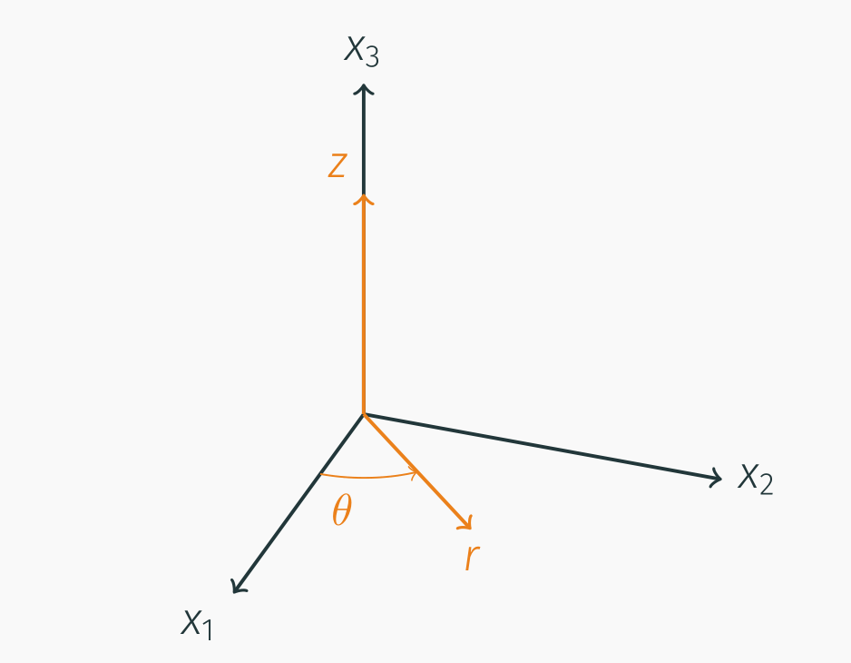 <!-- .element width="75%" -->

----
## cylindrical coordinates

-   We can convert between Cartesian and cylindrical coordinate systems

$$\\begin{aligned}
  x\_1 &= r\\cos \\theta \\\\
  x\_2 &= r\\sin \\theta \\\\
  x\_3 &= z
\\end{aligned}$$

-   Or to convert from Cartesian to cylindrical

$$\\begin{aligned}
  r &= \\sqrt{x\_1^2 + x\_2^2}\\\\
  \\theta &= \\tan^{-1} \\left(\\frac{x\_2}{x\_1}\\right)\\\\
  z &= x\_3
\\end{aligned}$$

----
## spherical coordinates

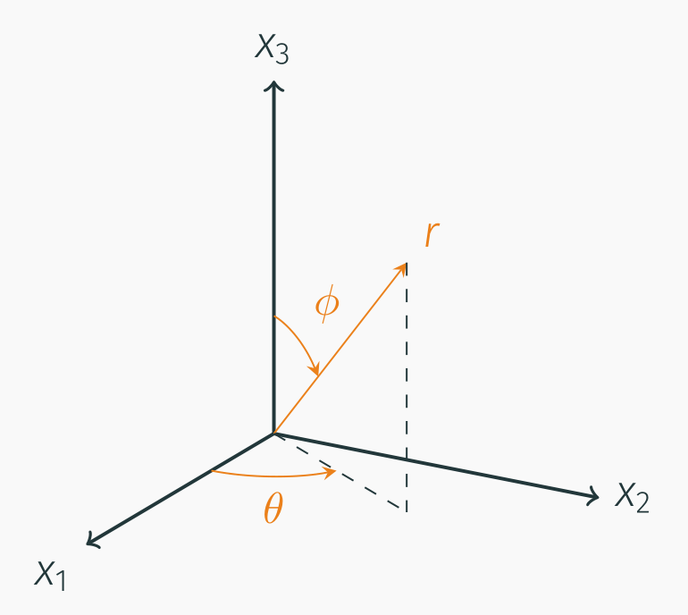 <!-- .element width="75" -->

----
## spherical coordinates

-   We can convert between Cartesian and spherical coordinate systems
-  <!-- .element style="list-style-type:none" --> $$\\begin{aligned}
  x\_1 &= r\\cos \\theta \\sin \\phi \\\\
  x\_2 &= r\\sin \\theta \\sin \\phi \\\\
  x\_3 &= r\\cos \\phi
\\end{aligned}$$
-   Or to convert from Cartesian to cylindrical
-  <!-- .element style="list-style-type:none" --> $$\\begin{aligned}
  r &= \\sqrt{x\_1^2 + x\_2^2 + x\_3^2}\\\\
  \\phi &= \\cos ^{-1} \\left(\\frac{x\_3}{\\sqrt{x\_1^2 + x\_2^2 + x\_3^2}}\\right)\\\\
  \\theta &= \\tan^{-1} \\left(\\frac{x\_2}{x\_1}\\right)
\\end{aligned}$$

----
## calculus in cylindrical coordinates

$$\\begin{aligned}
    \\nabla f &= \\frac{\\partial f}{\\partial r} \\hat{r} + \\frac{1}{r}\\frac{\\partial f}{\\partial \\theta} \\hat{\\theta} + \\frac{\\partial f}{\\partial z}\\hat{z}\\\\
    \\nabla \\cdot \\mathbf{u} &= \\frac{1}{r} \\frac{\\partial (r u\_r)}{\\partial r} + \\frac{1}{r} \\frac{\\partial u\_\\theta}{\\partial \\theta} + \\frac{\\partial u\_z}{\\partial z}\\\\
    \\nabla \\times \\mathbf{u} &= \\left(\\frac{1}{r}\\frac{\\partial u\_z}{\\partial \\theta} - \\frac{\\partial u\_\\theta}{\\partial z}\\right)\\hat{r} +
    \\left(\\frac{\\partial u\_r}{\\partial z} - \\frac{\\partial u\_z}{\\partial r}\\right)\\hat{\\theta} +
    \\frac{1}{r}\\left(\\frac{\\partial (r u\_\\theta)}{\\partial r} - \\frac{\\partial u\_r}{\\partial \\theta}\\right) \\hat{z}
\\end{aligned}$$

----
## calculus in spherical coordinates

$$\\begin{aligned}
    \\nabla f =& \\frac{\\partial f}{\\partial r} \\hat{r} + \\frac{1}{r}\\frac{\\partial f}{\\partial \\phi} \\hat{\\phi} + \\frac{1}{r \\sin \\phi}\\frac{\\partial f}{\\partial \\theta}\\hat{\\theta}\\\\
    \\nabla \\cdot \\mathbf{u} =& \\frac{1}{r^2} \\frac{\\partial (r^2 u\_r)}{\\partial r} + \\frac{1}{r \\sin \\phi} \\frac{\\partial (u\_\\phi \\sin \\phi)}{\\partial \\phi} + \\frac{1}{r \\sin \\phi}\\frac{\\partial u\_\\theta}{\\partial \\theta}\\\\
    \\nabla \\times \\mathbf{u} =& \\frac{1}{r\\sin \\phi}\\left(\\frac{\\partial (u\_\\theta \\sin \\phi)}{\\partial \\phi} - \\frac{\\partial u\_\\phi}{\\partial \\theta}\\right)\\hat{r} +
    \\frac{1}{r}\\left(\\frac{1}{\\sin \\phi}\\frac{\\partial u\_r}{\\partial \\theta} - \\frac{\\partial (r u\_\\theta)}{\\partial r}\\right)\\hat{\\phi} + \\\\
    & \\frac{1}{r}\\left(\\frac{\\partial (r u\_\\phi)}{\\partial r} - \\frac{\\partial u\_r}{\\partial \\phi}\\right) \\hat{\\theta}
\\end{aligned}$$

---
# equilibrium equations

----
## static equilibrium

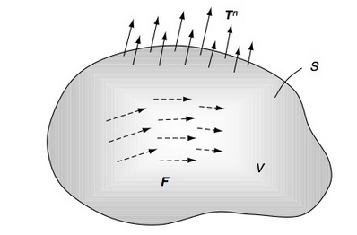

-   We primarily deal with bodies in static equilibrium
-   This means that all forces and moments must sum to zero
-   For a closed sub-domain of volume *V* and surface area *S* with internal body forces and applied tractions, we find
    ∬*S**T**i**n**dS* + ∭*V**F**i**dV* = 0

----
## static equilibrium

-   Using the Cauchy stress theorem, we can replace the traction vector with the stress tensor
    ∬*S**σ**ji**n**j**dS* + ∭*V**F**i**dV* = 0

-   We can also apply the divergence theorem to convert the surface integral to a volume integral
    ∭*V*(*σ**ji*, *j* + *F**i*)*dV* = 0

-   Since the volume is arbitrary (we could choose any volume and the conditions for equilibrium would still hold), the integrand must vanish
    *σ**ji*, *j* + *F**i* = 0

----
## equilibrium equations

-   Written in scalar form, the equilibrium equations are

$$\\begin{aligned}
	\\frac{\\partial \\sigma\_x}{\\partial x} + \\frac{\\partial \\tau\_{xy}}{\\partial y} + \\frac{\\partial \\tau\_{xz}}{\\partial z} + F\_x &= 0\\\\
  \\frac{\\partial \\tau\_{xy}}{\\partial x} + \\frac{\\partial \\sigma\_y}{\\partial y} + \\frac{\\partial \\tau\_{yz}}{\\partial z} + F\_y &= 0\\\\
  \\frac{\\partial \\tau\_{xz}}{\\partial x} + \\frac{\\partial \\tau\_{yz}}{\\partial y} + \\frac{\\partial \\sigma\_z}{\\partial z} + F\_z &= 0\\\\
\\end{aligned}$$

----
## angular momentum

-   Similarly, the principle of angular momentum states that the moment forces must all sum to zero as well
    ∬*S**ϵ**ijk**x**j**T**k**n**dS* + ∭*V**ϵ**ijk**x**j**F**k**dV* = 0

-   Once again we use Cauchy’s stress theorem
    ∬*S**ϵ**ijk**x**j**σ**lk**n**l**dS* + ∭*V**ϵ**ijk**x**j**F**k**dV* = 0

-   And the divergence theorem
    ∭*V*\[(*ϵ**ijk**x**j**σ**lk*),*l* + *ϵ**ijk**x**j**F**k*\]*dV* = 0

----
## angular momentum

-   Expanding the derivative using the chain rule gives
    ∭*V*\[*ϵ**ijk**x**j*, *l**σ**lk* + *ϵ**ijk**x**j**σ**lk*, *l* + *ϵ**ijk**x**j**F**k*\]*dV* = 0

-   Which can be simplified (recall that *σ**ji*, *j* + *F**i* = 0)

$$\\begin{aligned}
  \\iiint\_V \[ \\epsilon\_{ijk}\\delta\_{jl}\\sigma\_{lk} + \\epsilon\_{ijk}x\_j\\sigma\_{lk,l} + \\epsilon\_{ijk}x\_jF\_k \] dV &= 0\\\\
  \\iiint\_V \[ \\epsilon\_{ijk}\\sigma\_{jk} - \\epsilon\_{ijk}x\_jF\_k + \\epsilon\_{ijk}x\_jF\_k \] dV &= 0\\\\
  \\iiint\_V \\epsilon\_{ijk}\\sigma\_{jk} dV &= 0
\\end{aligned}$$

----
## angular momentum

-   Using the same argument as before (arbitrary volume) the integrand must vanish
    *ϵ**ijk**σ**jk* = 0

-   Since the alternating symbol is antisymmetric in *jk*, *σ**jk* must be symmetric in *jk* for this to vanish
-   And thus we have proved that the stress tensor is symmetric, thus equilibrium and angular momentum equations are satisfied when
    *σ**ji*, *j* + *F**i* = 0

----
## example

-   Under what circumstances is the following stress field in static equilibrium?

-  <!-- .element style="list-style-type:none" --> *σ*11 = 3*x*1 + *k*1*x*22, *σ*22 = 2*x*1 + 4*x*2, *σ*12 = *σ*21 = *a* + *bx*1 + *cx*12 + *dx*2 + *ex*22 + *fx*1*x*2

-   We are only examining the stress field, so we neglect any internal body forces

----
## example

-   The first equilibrium equation gives
    $$\\frac{\\partial \\sigma\_{11}}{\\partial x\_1} + \\frac{\\partial \\sigma\_{12}}{\\partial x\_2} = 0$$
    3 + *d* + 2*ex*2 + *fx*1 = 0
 
-   The second equilibrium equation gives
    $$\\frac{\\partial \\sigma\_{12}}{\\partial x\_1} + \\frac{\\partial \\sigma\_{22}}{\\partial x\_2} = 0$$
    *b* + 2*cx*1 + *fx*2 + 4 = 0

---
# spherical and cylindrical coordinates

----
## cylindrical coordinates

 <!-- .element width="75%" -->

----
## stress in cylindrical coordinates

-   We can also define stress in a cylindrical coordinate system

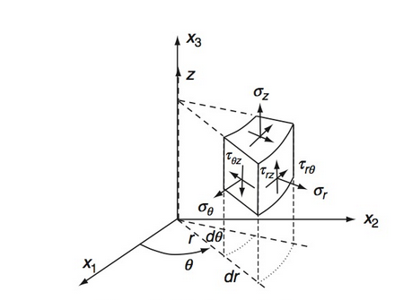 <!-- .element width="75%" -->

----
## stress in cylindrical coordinates

-   The stress tensor in cylindrical coordinates is

$$\\sigma\_{ij} = \\begin{bmatrix}
 \\sigma\_r & \\tau\_{r\\theta}& \\tau\_{rz} \\\\
 \\tau\_{r\\theta} & \\sigma\_{\\theta} & \\tau\_{\\theta z}\\\\
 \\tau\_{rz} & \\tau\_{\\theta z} & \\sigma\_z
\\end{bmatrix}$$

----
## equilibrium in cylindrical coordinates

-   Using the derivative relationships developed in Chapter 1, we can express the equilibrium equations as

$$\\begin{aligned}
  \\frac{\\partial \\sigma\_r}{\\partial r} + \\frac{1}{r} \\frac{\\partial \\tau\_{r \\theta}}{\\partial \\theta} + \\frac{\\partial \\tau\_{rz}}{\\partial z} + \\frac{1}{r}(\\sigma\_r - \\sigma\_\\theta) + F\_r &= 0\\\\
  \\frac{\\partial \\tau\_{r \\theta}}{\\partial r} + \\frac{1}{r} \\frac{\\partial \\sigma\_\\theta}{\\partial \\theta} + \\frac{\\partial \\tau\_{\\theta z}}{\\partial z} + \\frac{2}{r}\\tau\_{r\\theta} + F\_\\theta &= 0\\\\
  \\frac{\\partial \\tau\_{r z}}{\\partial r} + \\frac{1}{r} \\frac{\\partial \\tau\_{\\theta z}}{\\partial \\theta} + \\frac{\\partial \\sigma\_z}{\\partial z} + \\frac{1}{r}\\tau\_{rz} + F\_z &= 0
\\end{aligned}$$

----
## spherical coordinates

-   We can do the same thing in spherical coordinates

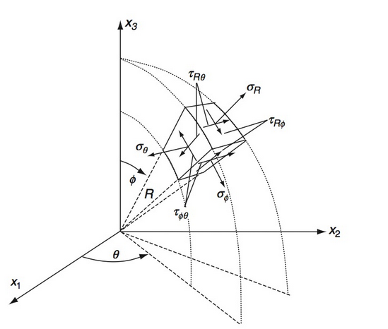 <!-- .element width="75%" -->

----
## spherical coordinates

-   The stress tensor in spherical coordinates is

$$\\sigma\_{ij} = \\begin{bmatrix}
  \\sigma\_r & \\tau\_{r\\phi}& \\tau\_{r\\theta} \\\\
  \\tau\_{r\\phi} & \\sigma\_{\\phi} & \\tau\_{\\phi \\theta}\\\\
  \\tau\_{r\\theta} & \\tau\_{\\phi \\theta} & \\sigma\_\\theta
\\end{bmatrix}$$

----
## spherical equilibrium

$$\\begin{aligned}
  \\frac{\\partial \\sigma\_r}{\\partial r} + \\frac{1}{r} \\frac{\\partial \\tau\_{r \\phi}}{\\partial \\phi} + \\frac{1}{r \\sin \\phi}\\frac{\\partial \\tau\_{r\\theta}}{\\partial \\theta} + \\frac{1}{r}(2\\sigma\_r - \\sigma\_\\phi - \\sigma\_\\theta + \\tau\_{r\\phi}\\cot \\phi) + F\_r &= 0\\\\
  \\frac{\\partial \\tau\_{r \\phi}}{\\partial r} + \\frac{1}{r} \\frac{\\partial \\sigma\_\\phi}{\\partial \\phi} + \\frac{1}{r \\sin \\phi}\\frac{\\partial \\tau\_{\\phi \\theta}}{\\partial \\theta} + \\frac{1}{r}\[(\\sigma\_\\phi -\\sigma\_\\theta)\\cot \\phi + 3\\tau\_{r\\phi}\] + F\_\\phi &= 0\\\\
  \\frac{\\partial \\tau\_{r \\theta}}{\\partial r} + \\frac{1}{r} \\frac{\\partial \\tau\_{\\phi \\theta}}{\\partial \\phi} + \\frac{1}{r \\sin \\phi}\\frac{\\partial \\sigma\_\\theta}{\\partial \\theta} + \\frac{1}{r}(2 \\tau\_{\\phi \\theta}\\cot \\phi + 3 \\tau\_{r \\theta}) + F\_\\theta &= 0
\\end{aligned}$$

---
# field equations

----
## field equations

-   Field equations that we have already found
-   Strain-displacement

$$\\epsilon\_{ij} = \\frac{1}{2}(u\_{i,j} + u\_{j,i})$$

-   Equilibrium
    *σ**ij*, *j* + *F**i* = 0

-   Constitutive (Hooke’s Law)

$$\\begin{aligned}
  \\sigma\_{ij} &= \\lambda \\epsilon\_{kk}\\delta\_{ij} + 2\\mu \\epsilon\_{ij}\\\\
  \\epsilon\_{ij} &= \\frac{1+\\nu}{E}\\sigma\_{ij} - \\frac{\\nu}{E}\\sigma\_{kk} \\delta\_{ij}
\\end{aligned}$$

----
## field equations

-   There are 15 unique field equations to solve for the 15 unknowns
-   3 displacements (*u**i*), 6 unique strain tensor terms (*ϵ**ij*), and 6 unique stress tensor terms (*σ**ij*)
-   These equations also depend on a knowledge of the material behavior (*λ*, *μ*) and body forces (usually gravity or zero)

----
## compatibility equations

-   If continuous, single-valued displacements are specified, differentiation will result in well-behaved strain field
-   The inverse relationship, integration of a strain field to find displacement, may not always be true
-   There are cases where we can integrate a strain field to find a set of discontinuous displacements

----
## compatibility 

-   The compatibility equations enforce continuity of displacements to prevent this from occurring
-   To enforce this condition we consider the strain-displacement relations:

$$\\epsilon\_{ij} = \\frac{1}{2}(u\_{i,j} + u\_{j,i})$$

-   and differentiate with respect to *x**k* and *x**l*

$$\\epsilon\_{ij,kl} = \\frac{1}{2}(u\_{i,jkl} + u\_{j,ikl})$$

-   Or
    2*ϵ**ij*, *kl* = *u**i*, *jkl* + *u**j*, *ikl*

----
## compatibility 

-   We can eliminate the displacement terms from the equation by interchanging the indexes to generate new equations

$$\\begin{aligned}
  2\\epsilon\_{ik,jl} &= u\_{i,jkl} + u\_{k,ijl} \\\\
  2\\epsilon\_{jl,ik} &= u\_{j,ikl} + u\_{l,ijk}
\\end{aligned}$$

-   Solving for *u**i*, *jkl* and *u**j*, *ikl*

$$\\begin{aligned}
  u\_{i,jkl} &= 2\\epsilon\_{ik,jl} - u\_{k,ijl} \\\\
  u\_{j,ikl} &= 2\\epsilon\_{jl,ik} - u\_{l,ijk}
\\end{aligned}$$

----
## compatibility 

-   Substituting these values into the equations gives
    2*ϵ**ij*, *kl* = 2*ϵ**ik*, *jl* − *u**k*, *ijl* + 2*ϵ**jl*, *ik* − *u**l*, *ijk*

-   We now consider one more change of index equation
    2*ϵ**kl*, *ij* = *u**k*, *ijl* + *u**l*, *ijk*

-   and substituting this result gives
    2*ϵ**ij*, *kl* = 2*ϵ**ik*, *jl* + 2*ϵ**jl*, *ik* − 2*ϵ**kl*, *ij*

-   Or, simplified
    *ϵ**ij*, *kl* + *ϵ**kl*, *ij* − *ϵ**ik*, *jl* − *ϵ**jl*, *ik* = 0

----
## compatibility equations

-   The so-called *Saint-Venant compatibility equations* in full are a system of 81 equations, but only six are useful (although even these six are not entirely linearly independent)
-   These six are found by setting *k* = *l*

----
## compatibility

$$\\begin{aligned}
  \\frac{\\partial^2 \\epsilon\_x}{\\partial y^2} + \\frac{\\partial^2 \\epsilon\_y}{\\partial x^2} &= 2\\frac{\\partial^2 \\epsilon\_{xy}}{\\partial x \\partial y}\\\\
  \\frac{\\partial^2 \\epsilon\_y}{\\partial z^2} + \\frac{\\partial^2 \\epsilon\_z}{\\partial y^2} &= 2\\frac{\\partial^2 \\epsilon\_{yz}}{\\partial y \\partial z}\\\\
  \\frac{\\partial^2 \\epsilon\_z}{\\partial x^2} + \\frac{\\partial^2 \\epsilon\_x}{\\partial z^2} &= 2\\frac{\\partial^2 \\epsilon\_{zx}}{\\partial z \\partial x}\\\\
  \\frac{\\partial^2 \\epsilon\_x}{\\partial y \\partial z} &= \\frac{\\partial}{\\partial x} \\left(-\\frac{\\partial \\epsilon\_{yz}}{\\partial x} + \\frac{\\partial \\epsilon\_{zx}}{\\partial y} + \\frac{\\partial \\epsilon\_{xy}}{\\partial z}\\right)\\\\
  \\frac{\\partial^2 \\epsilon\_y}{\\partial z \\partial x} &= \\frac{\\partial}{\\partial y} \\left(-\\frac{\\partial \\epsilon\_{zx}}{\\partial y} + \\frac{\\partial \\epsilon\_{xy}}{\\partial z} + \\frac{\\partial \\epsilon\_{yz}}{\\partial x}\\right)\\\\
  \\frac{\\partial^2 \\epsilon\_z}{\\partial x \\partial y} &= \\frac{\\partial}{\\partial z} \\left(-\\frac{\\partial \\epsilon\_{xy}}{\\partial z} + \\frac{\\partial \\epsilon\_{yz}}{\\partial x} + \\frac{\\partial \\epsilon\_{zx}}{\\partial y}\\right)
\\end{aligned}$$

----
## compatibility 

-   The compatibility equations are necessary to ensure that the strain field is valid and will produce a continuous displacement field
-   While these equations are important and necessary in solving elasticity problems, they are not sufficient
-   15 equations with 15 “unknowns” but each of these “unknowns” could actually be a function with many more unknowns, we need to develop framework for simplifying the problem into something we can solve

---
# boundary conditions

----
## boundary conditions

-   Boundary conditions commonly specify how a body is supported and/or how it is loaded
-   Mathematically we treat this conditions as *displacements* or *tractions* at boundary points.
-   Symmetry boundary conditions are also common, can reduce computational cost and simplify analytic solutions.

----
## boundary conditions

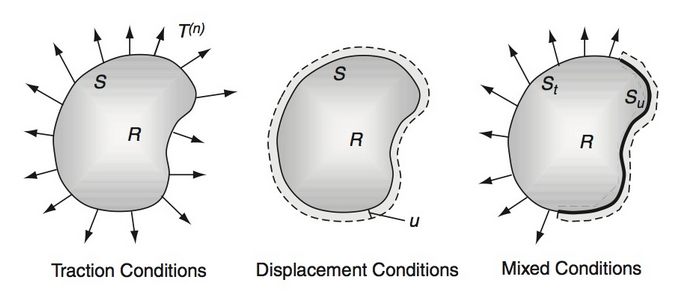

----
## symmetric boundaries

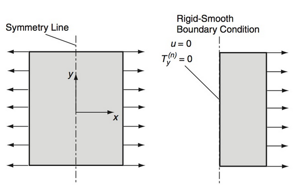

----
## coordinate systems

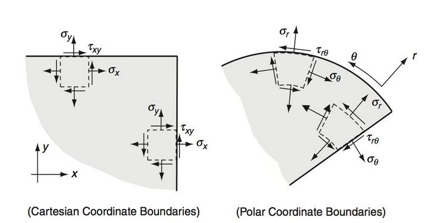

----
## boundaries

-   In many systems, the boundaries are parallel to the coordinate system, but this is not always the case

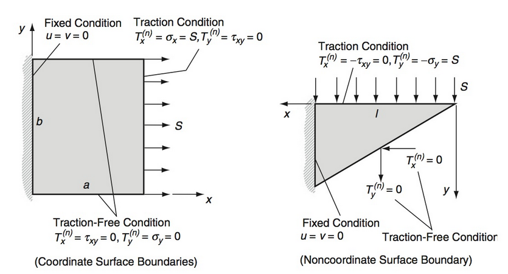 <!-- .element width="60%" -->

----
## boundaries

-   We often translate traction boundary conditions into stress boundary conditions using Cauchy’s Stress Theorem
-   When the condition is on a face parallel to the coordinate system, this gives a zero-stress condition
    *t**j* = *σ**ij**n**i*
-   This results in *σ**xy* = *σ**yy* = 0

----
## boundaries

-   When the boundary is not parallel to the coordinate system, we do not necessarily have any zero-stress conditions

$$\\begin{aligned}
  t\_x &= \\sigma\_x n\_x + \\tau\_{xy} n\_y = 0 \\\\
  t\_y &= \\tau\_{xy} n\_x + \\sigma\_y n\_y = 0 \\\\
\\end{aligned}$$

----
## interfaces

-   When we deal with multiple materials, we must prescribe conditions at the interface of these materials
-   Some common *interface conditions* are
    -   *Perfectly bonded interface* where displacements and tractions are continuous at the interface
    -   *Slip interface* where only normal displacements and tractions are continuous at the interface, with no tangential traction and potentially discontinuous tangential displacement

---
# stress formulation

----
## stress formulation

-   For traction problems (i.e. traction is defined on all surfaces) it is convenient to re-formulate field equations in terms of stress only
-   Since displacements are eliminated, we will need to use the compatibility equations to ensure a continuous displacement field
-   It is desirable for this formulation to write the compatibility equations in terms of stress

----
## stress formulation

-   We start by using Hooke’s law for each of the strain terms
-   <!-- .element style="list-style-type:none" -->$$\\epsilon\_{ij} = \\frac{1+\\nu}{E}\\sigma\_{ij} - \\frac{\\nu}{E}\\sigma\_{kk} \\delta\_{ij}$$
-   After some tedious algebra, we find

$$\\hspace{-1cm}
  \\tiny{\\sigma\_{ij,kk} + \\sigma\_{kk,ij} - \\sigma\_{ik,jk} - \\sigma\_{jk,ik} = \\frac{\\nu}{1+\\nu} (\\sigma\_{mm,kk}\\delta\_{ij} + \\sigma\_{mm,ij}\\delta\_{kk} - \\sigma\_{mm,jk}\\delta\_{ik} - \\sigma\_{mm,ik}\\delta\_{jk})}$$

----
## stress formulation

-   If we also include the equilibrium equations (*σ**ij*, *j* − *F**i*) in the formulation, we find

$$\\sigma\_{ij,kk} + \\frac{1}{1+\\nu}\\sigma\_{kk,ij} = \\frac{\\nu}{1+\\nu}\\sigma\_{mm,kk}\\delta\_{ij} - F\_{i,j} - F\_{j,i}$$

-   We can further simplify the equation by consider the case when *i* = *j* and nothing that

$$\\sigma\_{ii,kk} = -\\frac{1+\\nu}{1-\\nu}F\_{i,i}$$

----
## stress formulation

-   Which we can substitute into the equation to find

$$\\sigma\_{ij,kk} + \\frac{1}{1+\\nu}\\sigma\_{kk,ij} = -\\frac{\\nu}{1+\\nu}\\delta\_{ij}F\_{k,k} - F\_{i,j} - F\_{j,i}$$

----
## beltrami-michell compatibility

-   The compatibility equations in terms of stress are commonly known as the *Beltrami-Michell compatibility equations*
-   When there are no body forces, we can write the six expanded form equations 

----
## beltrami-michell

$$\\begin{aligned}
  (1+\\nu) \\nabla^2 \\sigma\_x + \\frac{\\partial^2}{\\partial x^2} (\\sigma\_x + \\sigma\_y + \\sigma\_z) &= 0\\\\
  (1+\\nu) \\nabla^2 \\sigma\_y + \\frac{\\partial^2}{\\partial y^2} (\\sigma\_x + \\sigma\_y + \\sigma\_z) &= 0\\\\
  (1+\\nu) \\nabla^2 \\sigma\_z + \\frac{\\partial^2}{\\partial z^2} (\\sigma\_x + \\sigma\_y + \\sigma\_z) &= 0\\\\
  (1+\\nu) \\nabla^2 \\tau\_{xy} + \\frac{\\partial^2}{\\partial x \\partial y} (\\sigma\_x + \\sigma\_y + \\sigma\_z) &= 0\\\\
  (1+\\nu) \\nabla^2 \\tau\_{yz} + \\frac{\\partial^2}{\\partial y \\partial z} (\\sigma\_x + \\sigma\_y + \\sigma\_z) &= 0\\\\
  (1+\\nu) \\nabla^2 \\tau\_{zx} + \\frac{\\partial^2}{\\partial z \\partial x} (\\sigma\_x + \\sigma\_y + \\sigma\_z) &= 0\\\\
\\end{aligned}$$

----
## stress formulation

-   When working with traction boundary problems, these compatibility equations, together with the equilibrium equations, are sufficient to solve the problem
-   These partial differential equations are not easy to solve, and analytic problems approached this way are often solved only in 2D
-   Solutions are also commonly based on *stress functions*, which gives a base equation form that automatically satisfies equilibrium

----
## solution methods

-   Direct method
    -   Solved via direction integration
    -   Limited to very simple geometries
-   Inverse method
    -   Choose a basic form for the solution based on our knowledge of the problem
    -   Solve for coefficients
    -   Usually we know the answer before we know the problem, it can be difficult to find useful problems for our solution

----
## solution methods

-   Semi-inverse method
    -   Only part of the solution is assumed
    -   Use direct integration to find the rest

---
# strain energy

----
## strain energy

-   Energy stored by deformation
-   In linear elasticity it is given as

$$U = \\frac{1}{2}V \\sigma\_{ij} \\epsilon\_{ij}$$

----
## rod

-   Strain energy in a 1D rod in tension can be expressed as

$$U = \\int\_0^L \\frac {P^2}{EA} dx$$

----
## beam

-   In a beam under pure bending we find the strain energy as

$$U = \\int\_0^L \\frac{M^2}{2EI} dx$$

---
# example

----
## Levy’s problem

-   Find the stresses in a semi-infinite wedge due to fluid pressure and its own self-weight

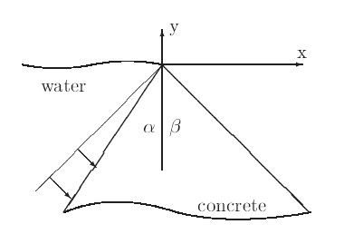

----
## Levy’s problem

-   Since pressure varies linearly with depth, we will assume a linear state of stress

$$\\begin{aligned}
  \\sigma\_{x} &= a\_1 x + b\_1 y + c\_1\\\\
  \\sigma\_{y} &= a\_2 x + b\_2 y + c\_2\\\\
  \\tau\_{xy} &= a\_{12}x + b\_{12} y + c\_{12}\\\\
\\end{aligned}$$

-   This leaves 9 coefficients to be determined

----
## Levy’s problem

-   First let us consider the boundary conditions at the apex of the dam
-   If we let the origin be at the apex of the dam, which must be traction free, we find
    *c*1 = *c*2 = *c*12 = 0

----
## Levy’s problem

-   Next let us consider the equilibrium equations

$$\\begin{aligned}
  \\sigma\_{x,x} + \\tau\_{xy,y} + \\rho b\_x &= 0\\\\
  \\tau\_{xy,x} + \\sigma\_{y,y} + \\rho b\_y &= 0
\\end{aligned}$$

-   Which in this case become

$$\\begin{aligned}
  a\_1 + b\_{12} + 0 &= 0\\\\
  a\_{12} + b\_2 - \\rho g &= 0
\\end{aligned}$$

----
## Levy’s problem

-   The stresses can now be written as

$$\\begin{aligned}
  \\sigma\_x &= a\_1 x + b\_1 y\\\\
  \\sigma\_y &= a\_2 x + b\_2 y\\\\
  \\tau\_{xy} &= -b\_2 x + \\rho g x - a\_1 y
\\end{aligned}$$

----
## Levy’s problem

-   The compatibility equations are all satisfied, as these linear functions will all go to zero when taking second derivatives
-   We now consider the boundary conditions along both faces

---
# airy stress functions

----
## airy stress function

-   A stress function technique that can be used to solve many planar problems is known as the *Airy stress function*
-   This method reduces the governing equations for a planar problem to a single unknown function
-   We assume first that body forces are derivable from a *potential function*, *V*

----
## airy stress function

$$\\begin{aligned}
  F\_x &= -\\frac{\\partial V}{\\partial x}\\\\
  F\_y &= -\\frac{\\partial V}{\\partial y}
\\end{aligned}$$

-   How restrictive is this assumption?
-   Most body forces are linear (gravity) and can easily be represented this way

----
## airy stress function

-   Consider the following

$$\\begin{aligned}
  \\sigma\_{xx} &= \\frac{\\partial^2 \\phi}{\\partial y^2} + V\\\\
  \\sigma\_{yy} &= \\frac{\\partial^2 \\phi}{\\partial x^2} + V\\\\
  \\tau\_{xy} &= -\\frac{\\partial^2 \\phi}{\\partial x \\partial y}
\\end{aligned}$$

-   The function *ϕ* = *ϕ*(*x*, *y*) is known as the Airy stress function
-   Equilibrium is automatically satisfied

----
## compatibility

-   Substituting the Airy Stress function and potential function into the relationships, we find

$$\\begin{aligned}
  \\tiny{\\frac{\\partial^4 \\phi}{\\partial x^4} + 2\\frac{\\partial^4 \\phi}{\\partial x^2 \\partial y^2} + \\frac{\\partial^4 \\phi}{\\partial y^4} &= - \\frac{1-2\\nu}{1-\\nu}\\left(\\frac{\\partial^2 V}{\\partial x^2} + \\frac{\\partial^2 V}{\\partial y^2}\\right) &\\text{plane strain}}\\\\
  \\tiny{\\frac{\\partial^4 \\phi}{\\partial x^4} + 2\\frac{\\partial^4 \\phi}{\\partial x^2 \\partial y^2} + \\frac{\\partial^4 \\phi}{\\partial y^4} &= - (1-\\nu)\\left(\\frac{\\partial^2 V}{\\partial x^2} + \\frac{\\partial^2 V}{\\partial y^2}\\right) &\\text{plane stress}}
\\end{aligned}$$

----
## compatibility

-   If there are no body forces, or the potential function satisfies Laplace’s Equation
    ∇2*V* = 0
     Then both plane stress and plane strain reduce to

$$\\frac{\\partial^4 \\phi}{\\partial x^4} + 2\\frac{\\partial^4 \\phi}{\\partial x^2 \\partial y^2} + \\frac{\\partial^4 \\phi}{\\partial y^4} = 0$$

----
## polar coordinates

-   Recall that an Airy Stress function must satisfy the Beltrami-Mitchell compatibility equations

$$\\nabla^4 \\phi = \\left(\\frac{\\partial ^2}{\\partial r^2} + \\frac{1}{r} \\frac{\\partial}{\\partial r} + \\frac{1}{r^2}\\frac{\\partial ^2}{\\partial \\theta^2}\\right)^2\\phi = 0$$

----
## polar coordinates

-   One method which gives several useful solutions assumes that the Airy Stress function has the form *ϕ*(*r*, *θ*)=*f*(*r*)*e**bθ*
-   Substituting this into the compatibility equations (and canceling the common *e**bθ*) term gives

$$f^{\\prime \\prime \\prime \\prime} + \\frac{2}{r} f^{\\prime \\prime \\prime} - \\frac{1-2b^2}{r^2}f^{\\prime \\prime} + \\frac{1-2b^2}{r^3}f^{\\prime} + \\frac{b^2(4+b^2)}{r^4}f = 0$$

----
## polar coordinates

-   To solve this, we perform a change of variables, letting *r* = *e**ξ*, which gives
- <!-- .element style="list-style-type:none" -->   *f*′′′′ − 4*f*′′′ + (4 + 2*b*2)*f*′′ − 4*b*2*f*′ + *b*2(4 + *b*2)*f* = 0
-   We know consider *f* to have the form *f* = *e**aξ* which generates the characteristic equation
- <!-- .element style="list-style-type:none" -->  (*a*2 + *b*2)(*a*2 − 4*a* + 4 + *b*2)=0

----
## polar coordinates

-   This has solutions

$$\\begin{aligned}
  a &= \\pm ib, \\pm 2ib\\\\
  \\text{OR}\\\\
  b &= \\pm ia, \\pm i(a-2)
\\end{aligned}$$

----
## polar coordinates

-   All solutions to the Beltrami-Mitchell equations in polar coordinates which are periodic in *θ* can be summarized as

$$\\begin{aligned}
  \\phi &= a\_0 + a\_1 \\log r + a\_2 r^2 + a\_3 r^2 \\log r \\\\
  &+ (a\_4 + a\_5 \\log r + a\_6 r^2 + a\_7 r^2 \\log r)\\theta \\\\
  &+ \\left(a\_{11}r + a\_{12}r\\log r + \\frac{a\_{13}}{r} + a\_{14}r^3 + a\_{15}r\\theta + a\_{16} r\\theta \\log r\\right) \\cos \\theta\\\\
  &+  \\left(b\_{11}r + b\_{12}r\\log r + \\frac{b\_{13}}{r} + b\_{14}r^3 + b\_{15}r\\theta + b\_{16} r\\theta \\log r\\right) \\sin \\theta\\\\
  &+ \\sum\_{n=2}^{\\infty} (a\_{n1}r^n + a\_{n2}r^{2+n}+a\_{n3}r^{-n}+a\_{n4}r^{2-n})\\cos n\\theta\\\\
  &+ \\sum\_{n=2}^{\\infty} (b\_{n1}r^n + b\_{n2}r^{2+n}+a\_{n3}r^{-n}+b\_{n4}r^{2-n})\\sin n\\theta\\\\
\\end{aligned}$$

----
## polar coordinates

-   For axisymmetric problems, all field quantities are independent of *θ*
-   This reduces the general solution to
    *ϕ* = *a*0 + *a*1log*r* + *a*2*r*2 + *a*3*r*2log*r*

----
## polar coordinates

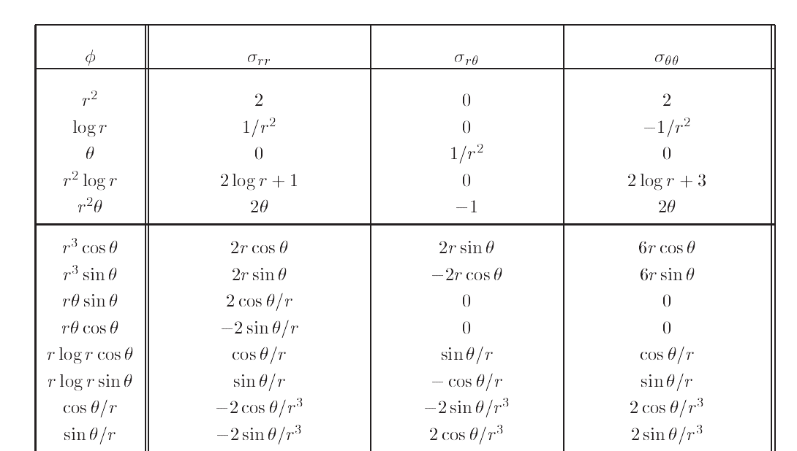

----
## polar coordinates

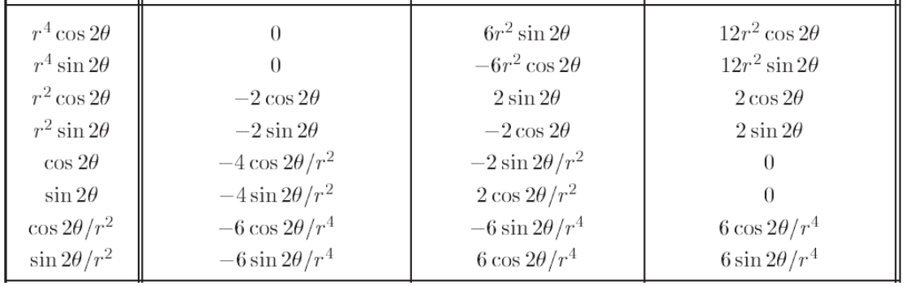
