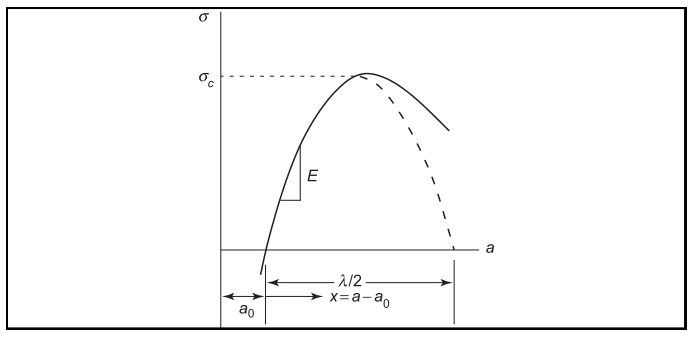

# AE837
## Advanced Mechanics of Damage Tolerance
Dr. Nicholas Smith 
Wichita State University, Department of Aerospace Engineering
August 27, 2019

----
## upcoming schedule

-   Aug 27 - Griffith Fracture
-   Aug 29 - Griffith Fracture
-		Sep 3 - Elastic Stress Field, Homework 1 Due
-		Sep 5 - Elastic Stress Field

----
## outline

<!-- vim-markdown-toc GFM -->

* theoretical strength
* griffith fracture
* energy release rate
* relation among energies

<!-- vim-markdown-toc -->

----
## office hours

-   The votes are in and we will hold office hours on Wednesdays from 3:00 - 4:00
-   Office Hours for Elasticity theory will be Mondays from 3:00 - 4:00
-   If neither time works, just send me an e-mail and we can work out an alternate time to meet

---
# theoretical strength

----
## theoretical strength

-   We can (theoretically) predict the strength of a material from the strength of its atomic bonds
-   As the distance between atoms increases (strain) so does the attractive force between them (stress) until some critical distance when they are no longer attracted to one another (failure)

----
## cohesive stress

 <!-- .element width="70%" -->

----
## theoretical strength

-   Using a sinusoidal approximation of strength we have

$$\\sigma = \\sigma\_c \\sin \\left(\\frac{2\\pi x}{\\lambda}\\right)$$

-   For small strains, sin(*x*)≈*x*
-   We can also write in terms of the modulus of elasticity, $E = \\frac{\\sigma}{\\epsilon} = \\frac{\\sigma}{x/a\_0}$

----
## theoretical strength

-   This means we can write $\\sigma = \\frac{E x}{a\_0}$, substituting into the original equation we find
- <!-- .element style="list-style-type:none" --> $$\frac{E x}{a_0} = \sigma_c \frac{2\pi x}{\lambda}$$
-   solving for *σ**c*, we find the theoretical strength as
- <!-- .element style="list-style-type:none" --> $$\sigma_c = \frac{\lambda E}{2\pi a_0}$$
-   In many materials, *λ* ≈ *a*0, in which case $\\sigma\_c = \\frac{E}{2 \\pi}$

----
## energy consideration

-   Surface energy is the work done to create a new surface when an atomic bond breaks
-   We define *γ* as the surface energy (units of energy/area)
-   We can calcualte this surface energy in terms of the sinusoidal approximation of traction-separation

$$2\\gamma = \\int\_0^{\\lambda/2} \\sigma\_c \\sin \\left(\\frac{2\\pi x}{\\lambda}\\right) dx = \\frac{\\lambda \\sigma\_c}{\\pi}$$

----
## energy consideration

-   re-arranging a previous result, we know that
- <!-- .element style="list-style-type:none" --> $$\lambda = \frac{2\pi a_0 \sigma_c}{E}$$
-   from which we find
- <!-- .element style="list-style-type:none" --> $$\sigma_c^2 = \frac{2\pi\gamma E}{2\pi a_0} = \frac{\gamma E}{a_0}$$
-   For many materials, the surface energy is approximately *γ* = 0.01*Ea*0, which gives an approximate theoretical strength of
- <!-- .element style="list-style-type:none" --> $$\sigma_c = \frac{E}{10}$$

---
# griffith fracture

----
## real failure

-   In practice, materials fail at loads 10 to 100 times lower than the theoretical “atomic” strength
-   Griffith studied glass, which by the atomic strength models should be a very strong material, but in practice is often weaker than much less stiff materials
-   He hypothesized that there were many micro-cracks which coalesced to cause failure

----
## elliptic hole

 <!-- .element width="70%" -->

----
## elliptic hole

-   Inglis solved the problem of an eliptic hole under remote tension, finding that at the edge of the major axis the stress is given by
- <!-- .element style="list-style-type:none" --> $$\\sigma\_{yy} = \\sigma \\left(1+\\frac{2a}{b}\\right)$$
-   For a crack as *b* → 0, we would get the unreasonable prediction that any stress, no matter how small, would produce failure as the stress at the edge of the ellipse would be infinite
-   Griffith took an energy balance approach

----
## surface energy

-   Griffith proposed that a crack would extend when the incremental release of energy, *dW* associated with a crack extension of *da* in a body is greater than the energy required to create the new surfaces, *dW**s*
-   For a center crack, there are two crack tips and a total of 4 surfaces, thus
- <!-- .element style="list-style-type:none" --> *W**s* = 2(2*aγ*)=4*aγ*

----
## surface energy

-   Griffith then used the Inglis solution to calculate the total energy released by a crack extension of *da*

$$\\begin{aligned}
    W &= \\frac{\\pi a^2 \\sigma^2 (1-\\nu^2)}{E} &\\qquad \\text{plane strain}\\\\
    W &= \\frac{\\pi a^2 \\sigma^2} {E} &\\qquad \\text{plane stress}
\\end{aligned}$$

----
## surface energy

-   We can now substitute to find under what conditions *dW* ≥ *dW**s*

$$\\begin{aligned}
    \\frac{2 \\pi a^2 \\sigma\_{cr}^2 (1-\\nu^2)}{E}da &= 4\\gamma da &\\qquad \\text{plane strain}\\\\
    \\frac{2 \\pi a^2 \\sigma\_{cr}^2} {E} da &= 4\\gamma da&\\qquad \\text{plane stress}
\\end{aligned}$$

----
## surface energy

-   Which gives the critical stress as

$$\\begin{aligned}
    \\sigma\_{cr} &= \\sqrt{\\frac{2 E \\gamma}{\\pi (1-\\nu^2)a}} &\\qquad \\text{plane strain}\\\\
    \\sigma\_{cr} &= \\sqrt{\\frac{2 E \\gamma}{\\pi a}} &\\qquad \\text{plane stress}
\\end{aligned}$$

----
## comparison

-   We can compare this critical stress prediction with previous methods
-   We had found

$$\\sigma\_c = \\sqrt{\\frac{\\gamma E}{a\_0}}$$

-   Thus when there is inherent damage in a materal larger than the twice the characteristic distance between atoms (*a*0), the fracture strength will be lower than the theoretical strength

---
# energy release rate

----
## energy release rate

-   We can now define the energy release rate
-   More precisely, “strain energy release rate per crack tip”
- <!-- .element style="list-style-type:none" --> *dW* = 2*Gda*
-   Which after substitution and integration gives

$$\\begin{aligned}
    G &= \\frac{1}{2} \\frac{dW}{da} = \\frac{\\pi a \\sigma^2 (1-\\nu^2)}{E} &\\text{plane strain}\\\\
    &= \\frac{\\pi a \\sigma^2}{E} & \\text{plane stress}
\\end{aligned}$$

----
## fracture toughness

-   When *G* ≥ 2*γ* the strain energy from the applied load is greater than the energy required to propagate a crack, and thus a crack will propagate
-   The critical strain energy release rate is called *G**c*, and is also referred to as the fracture toughness

----
## fracture toughness

-   Note: *K**c* (the critical stress intensity factor) is also referred to as the “fracture toughness,” and although they give equivalent predictions, they have different units 
-   The *G**c* predicted from the atomic surface energy will be somewhat conservative, since almost all materials will absorb at least some of the strain energy in plastic deformation

---
# relation among energies

----
## energy balance

-   Griffith’s theory is founded on the principle of energy balance
-   During crack extension, the external work done, *dW**e* must equal the increment of surface energy, *dW**s*, and the increment of elastic strain energy, *dU*
- <!-- .element style="list-style-type:none" --> *dW**s* + *dU* = *dW**e*

----
## energy balance

-   For a conservative field we can write this as
- <!-- .element style="list-style-type:none" --> $$\\frac{\\partial}{\\partial a} (W\_s + U + V) = 0$$
-   Where a negative potential, *V*, implies positive external work done *dW**e*

----
## example

 <!-- .element width="70%" -->

----
## example

-   The displacement at the top edge will be proportional to the applied load by some elastic compliance of the specimen
- <!-- .element style="list-style-type:none" --> *δ* = *SP*
-   Note that this compliance, *S*, will be a function of the crack length, *a*
-   The strain energy can be expressed as
- <!-- .element style="list-style-type:none" --> $$U = \\int\_{\\delta=0}^{\\delta=SP} P d\\delta = \\int\_{\\delta=0}^{\\delta=SP} \\frac{\\delta}{S} d\\delta$$

----
## example

-   After integrating
- <!-- .element style="list-style-type:none" --> $$U = \\frac{1}{2S}(\\delta^2)|\_0^{SP} = \\frac{1}{2}SP^2$$

----
## example

-   To find the incremental strain energy increase (where both *P* and *S* should be treated as variable), we find
- <!-- .element style="list-style-type:none" --> $$dU = \\frac{1}{2}P^2 dS + SP dP$$
-   We will now consider two loading cases, one with fixed displacement and the other with fixed loading force

----
## fixed displacement

-   Under constant displacement we have
- <!-- .element style="list-style-type:none" --> *δ* = *SP* = constant
-   This means that the derivative of displacement will be zero, hence
- <!-- .element style="list-style-type:none" --> *dδ* = *SdP* + *PdS* = 0
-   and
- <!-- .element style="list-style-type:none" --> *SdP* = −*PdS*

----
## fixed displacement

-   Substituting into the previous equation gives
- <!-- .element style="list-style-type:none" --> $$dU = -\\frac{1}{2}P^2 dS$$
-   Since *dδ* = 0, the external work, *dW**e* = 0 and we find
- <!-- .element style="list-style-type:none" --> $$dW\_s = -dU = \\frac{1}{2} P^2 dS$$

----
## fixed load

-   If instead of fixing displacement we fix the applied load we have
- <!-- .element style="list-style-type:none" -->   *dP* = 0
-   Which gives
- <!-- .element style="list-style-type:none" -->   $$dU = \\frac{1}{2}P^2 dS$$
-   The strain energy increases (while under fixed displacement it decreased)

----
## fixed load

-   Further, we can find the external work done as
- <!-- .element style="list-style-type:none" -->   *dW**e* = *Pdδ* = *P*2*dS*
-   And thus, from energy balance, we find the surface energy
- <!-- .element style="list-style-type:none" -->   $$dW\_s = \\frac{1}{2}P^2 dS$$
-   In this case the external work is equally split between strain energy and surface energy

----
## comparison

-   In both cases, the energy released is *dW* = *dW**e* − *dU*

$$\\begin{aligned}
    dW &= 0 - (-\\frac{1}{2} P^2 dS) &\\text{fixed displacement}\\\\
    dW &= P^2 dS - \\frac{1}{2}P^2 dS &\\text{fixed load}
\\end{aligned}$$

-   And we see that the energy released is independent of the load type

----
## example - double cantilever beam

 <!-- .element width="80%" -->
