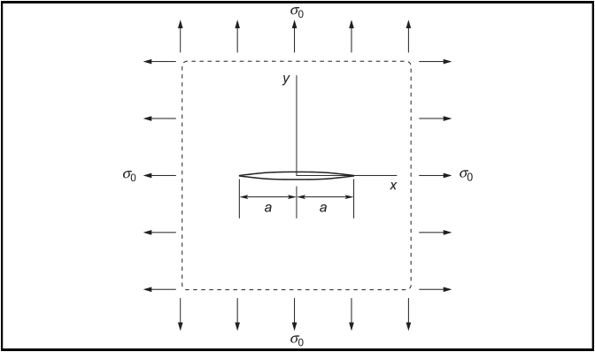
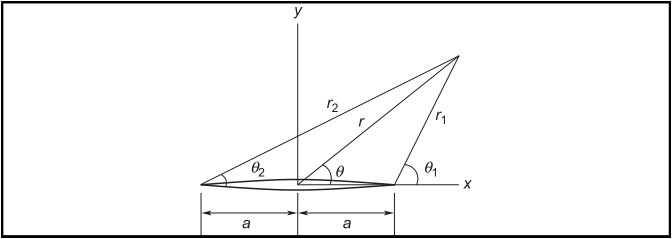

# AE837
## Advanced Mechanics of Damage Tolerance
Dr. Nicholas Smith 
Wichita State University, Department of Aerospace Engineering
September 3, 2019

----
## upcoming schedule

-		Sep 3 - Complex Airy Stress
-		Sep 5 - Mode II and III Westergaard, Homework 1 Due
-		Sep 10 - Stress Intensity Solutions
-   Sep 12 - Finite Size Effects, K-Dominance, HW 2 Due

----
## outline

<!-- vim-markdown-toc GFM -->

* review
* complex airy stress
* westergaard function method
* solutions using westergaard

<!-- vim-markdown-toc -->

---
# review

----
## fracture modes

----
## stress field

-   The approximate stress field for the various modes can be expressed in terms of the stress intensity factor

$$\\begin{aligned}
  \\sigma\_{yy} &= \\frac{K\_I}{\\sqrt{2\\pi x}} + O(\\sqrt{x}) & \\sigma\_{xy} = \\sigma\_{yz} = 0\\\\
  \\sigma\_{xy} &= \\frac{K\_II}{\\sqrt{2\\pi x}} + O(\\sqrt{x}) & \\sigma\_{yy} = \\sigma\_{yz} = 0\\\\
  \\sigma\_{yz} &= \\frac{K\_III}{\\sqrt{2\\pi x}} + O(\\sqrt{x}) & \\sigma\_{yy} = \\sigma\_{xy} = 0
\\end{aligned}$$

----
## airy stress function

-   A stress function technique that can be used to solve many planar problems is known as the *Airy stress function*
-   This method reduces the governing equations for a planar problem to a single unknown function

----
## airy stress function

-   We assume first that body forces are derivable from a *potential function*, *V*

$$\\begin{aligned}
	F\_x &= -\\frac{\\partial V}{\\partial x}\\\\
	F\_y &= -\\frac{\\partial V}{\\partial y}
\\end{aligned}$$

-   How restrictive is this assumption?
-   Most body forces are linear (gravity) and can easily be represented this way

----
## airy stress function

-   Consider the following

$$\\begin{aligned}
	\\sigma\_{xx} &= \\frac{\\partial^2 \\phi}{\\partial y^2} + V\\\\
	\\sigma\_{yy} &= \\frac{\\partial^2 \\phi}{\\partial x^2} + V\\\\
	\\tau\_{xy} &= -\\frac{\\partial^2 \\phi}{\\partial x \\partial y}
\\end{aligned}$$

-   The function *ϕ* = *ϕ*(*x*, *y*) is known as the Airy stress function
-   Equilibrium is automatically satisfied

----
## compatibility

-   Substituting the Airy Stress function and potential function into the relationships, we find

$$\\begin{aligned}
	\\frac{\\partial^4 \\phi}{\\partial x^4} + 2\\frac{\\partial^4 \\phi}{\\partial x^2 \\partial y^2} + \\frac{\\partial^4 \\phi}{\\partial y^4} &= - \\frac{1-2\\nu}{1-\\nu}\\left(\\frac{\\partial^2 V}{\\partial x^2} + \\frac{\\partial^2 V}{\\partial y^2}\\right) &\\text{plane strain}\\\\
	\\frac{\\partial^4 \\phi}{\\partial x^4} + 2\\frac{\\partial^4 \\phi}{\\partial x^2 \\partial y^2} + \\frac{\\partial^4 \\phi}{\\partial y^4} &= - (1-\\nu)\\left(\\frac{\\partial^2 V}{\\partial x^2} + \\frac{\\partial^2 V}{\\partial y^2}\\right) &\\text{plane stress}
\\end{aligned}$$

----
## compatibility

-   If there are no body forces, or the potential function satisfies Laplace’s Equation
- <!-- .element style="list-style-type:none; text-align:center;" -->   ∇2*V* = 0
-    Then both plane stress and plane strain reduce to
- <!-- .element style="list-style-type:none; text-align:center;" -->   $$\\frac{\\partial^4 \\phi}{\\partial x^4} + 2\\frac{\\partial^4 \\phi}{\\partial x^2 \\partial y^2} + \\frac{\\partial^4 \\phi}{\\partial y^4} = 0$$

---
# complex airy stress

----
## complex conjugates

-   In the cartesian system we can express complex conjugates as

$$\\begin{aligned}
    z &= x + iy\\\\
    \\bar{z} &= x - iy
\\end{aligned}$$

-   And in polar coordinates we have

$$\\begin{aligned}
    z &= r(\\cos \\theta + i \\sin \\theta) = re^{i\\theta}\\\\
    \\bar{z} &= r(\\cos \\theta - i \\sin \\theta) = re^{-i\\theta}
\\end{aligned}$$

----
## analytic functions

-   A complex function can be written as
- <!-- .element style="list-style-type:none; text-align:center;" -->   *f*(*z*)=*u*(*x*, *y*)+*iv*(*x*, *y*)
-   A complex function is said to be analytic if
- <!-- .element style="list-style-type:none; text-align:center;" -->   $$\\frac{\\partial}{\\partial x} f(z) = f^\\prime(z) \\frac{\\partial z}{\\partial x} = f^\\prime(z)$$
-    and
- <!-- .element style="list-style-type:none; text-align:center;" -->   $$\\frac{\\partial}{\\partial y} f(z) = f^\\prime(z) \\frac{\\partial z}{\\partial y} = i f^\\prime(z)$$

----
## Cauchy-Riemann

-   This means that

$$\\begin{aligned}
    \\frac{\\partial}{\\partial x} f(z) &= -i \\frac{\\partial}{\\partial y} f(z)\\\\
    \\frac{\\partial u}{\\partial x} + i \\frac{\\partial v}{\\partial x} &= \\frac{\\partial v}{\\partial y} - i \\frac{\\partial u}{\\partial y}
\\end{aligned}$$

----
## Cauchy-Riemann

-   From this we obtain the Cauchy-Riemann equations
- <!-- .element style="list-style-type:none; text-align:center;" -->   $$\\frac{\\partial u}{\\partial x} = \\frac{\\partial v}{\\partial y} \\qquad \\frac{\\partial v}{\\partial x} = - i \\frac{\\partial u}{\\partial y}$$
-   From which we can easily derive the following
- <!-- .element style="list-style-type:none; text-align:center;" -->   ∇2*u* = ∇2*v* = 0

----
## airy stress functions

-   The Airy stress function is biharmonic, we can write the following
- <!-- .element style="list-style-type:none; text-align:center;" -->   ∇2*ϕ* = *P*
-   From which we have
- <!-- .element style="list-style-type:none; text-align:center;" -->   ∇2*P* = ∇2∇2*ϕ* = 0
-   And thus *P* will satisfy the compatibility equations

----
## airy stress functions

-   We can say that *P* is the real part of a complex function
- <!-- .element style="list-style-type:none; text-align:center;" -->   *P* = *Re*{*f*(*z*)}  where  *f*(*z*)=*P* + *iQ*
-   Now we let
- <!-- .element style="list-style-type:none; text-align:center;" -->   $$\\psi(z) = \\frac{1}{4} \\int f(z) dz = p + iq$$
-   *ψ* will also be analytic, thus
- <!-- .element style="list-style-type:none; text-align:center;" -->   $$\\psi^\\prime(z) = \\frac{1}{4}f(z)$$

----
## airy stress functions

-   According to the Cauchy-Riemann equations we now have
- <!-- .element style="list-style-type:none; text-align:center;" -->   $$\\psi^\\prime(z) = \\frac{\\partial p}{\\partial x} + i \\frac{\\partial q}{\\partial x} = \\frac{\\partial q}{\\partial y} - i \\frac{\\partial p}{\\partial y}$$
-   And we find that
- <!-- .element style="list-style-type:none; text-align:center;" -->   $$P = 4 \\frac{\\partial p}{\\partial x} = 4 \\frac{\\partial q}{\\partial y}$$

----
## airy stress functions

-   If we now consider *ϕ* − (*xp* + *yq*), we can show that
- <!-- .element style="list-style-type:none; text-align:center;" -->   ∇2\[*ϕ* − (*xp* + *yq*)\] = 0
-   This means that *ϕ* − (*xp* + *yq*) is harmonic, and can be taken as either the real or imaginary portion of some analytic function, *χ*(*z*)
- <!-- .element style="list-style-type:none; text-align:center;" -->   *ϕ* − (*xp* + *yq*)=Re{*χ*(*z*)}
-   We can now say that
- <!-- .element style="list-style-type:none; text-align:center;" -->   $$xp + yq = \\text{Re}\\{ \\bar{z}\\psi(z) \\}$$

----
## complex airy stress 

-   The complex representation of the Airy stress function can now be written as

$$\\begin{aligned}
    \\phi &= \\text{Re}\\{ \\bar{z}\\psi(z) + \\chi(z) \\}\\\\
    2\\phi(x,y) &= \\bar{z}\\psi(z) + z\\bar{\\psi(z)} + \\chi(z) + \\bar{\\chi(z)}
\\end{aligned}$$

----
## complex airy stress

-   And from the definition of the Airy stress function we obtain

$$\\begin{aligned}
    \\sigma\_{xx} + i\\sigma\_{xy} &= \\frac{\\partial^2\\phi}{\\partial y^2} - i\\frac{\\partial^2\\phi}{\\partial x \\partial y} &= -i\\frac{\\partial}{\\partial y}\\left(\\frac{\\partial \\phi}{\\partial x} + i \\frac{\\partial \\phi}{\\partial y}\\right)\\\\
    \\sigma\_{yy} - i\\sigma\_{xy} &= \\frac{\\partial^2\\phi}{\\partial x^2} + i\\frac{\\partial^2\\phi}{\\partial x \\partial y} &= \\frac{\\partial}{\\partial x}\\left(\\frac{\\partial \\phi}{\\partial x} + i \\frac{\\partial \\phi}{\\partial y}\\right)
\\end{aligned}$$

----
## analytic functions and conjugates

$$\\begin{aligned}
    \\frac{\\partial f(z)}{\\partial x} &= f^\\prime \\frac{\\partial z}{\\partial x} &= f^\\prime(z)\\\\
    {\\frac{\\partial \\bar{f(z)}}{\\partial x}} &= \\bar{\\left( {\\frac{\\partial f(z)}{\\partial x}}\\right)} &= \\bar{f^\\prime(z)}\\\\
    {\\frac{\\partial f(z)}{\\partial y}} &= f^\\prime(z){\\frac{\\partial z}{\\partial y}} &= if^\\prime(z)\\\\
    {\\frac{\\partial \\bar{f(z)}}{\\partial y}} &= \\bar{\\left( {\\frac{\\partial f(z)}{\\partial y}}\\right)} &= -i\\bar{f^\\prime(z)}
\\end{aligned}$$

----
## complex airy stress

-   The above properties allow us to write
- <!-- .element style="list-style-type:none; text-align:center;" -->   $${\\frac{\\partial \\phi}{\\partial x}} + i{\\frac{\\partial \\phi}{\\partial y}} = \\psi(z) + z\\bar{\\psi^\\prime(z)} + \\bar{\\chi^\\prime(z)}$$
-   Which gives

$$\\begin{aligned}
    \\sigma\_{xx} + i\\sigma\_{xy} &= \\psi^\\prime(z) + \\bar{\\psi^\\prime(z)} - z\\bar{\\psi^{\\prime\\prime}(z)} - \\bar{\\chi^{\\prime \\prime}(z)}\\\\
    \\sigma\_{yy} - i\\sigma\_{xy} &= \\psi^\\prime(z) + \\bar{\\psi^\\prime(z)} + z\\bar{\\psi^{\\prime\\prime}(z)} + \\bar{\\chi^{\\prime \\prime}(z)}
\\end{aligned}$$

----
## complex airy stress 

-   We can add the two equations to find
- <!-- .element style="list-style-type:none; text-align:center;" -->   $$\\sigma\_{xx} + \\sigma\_{yy} = 2 (\\psi^\\prime(z) + \\bar{\\psi^\\prime(z)}) = 4 \\text{Re}\\{\\psi^\\prime(z)\\}$$
-   Similarly we can subtract the equations to find
- <!-- .element style="list-style-type:none; text-align:center;" -->   $$\\sigma\_{yy} - \\sigma\_{xx} - 2i\\sigma\_{xy} = 2(z\\bar{\\psi^{\\prime\\prime}(z)} + \\bar{\\chi^{\\prime \\prime}(z)})$$
-   We can re-write using the complex conjugate
- <!-- .element style="list-style-type:none; text-align:center;" -->   $$\\sigma\_{yy} - \\sigma\_{xx} + 2i\\sigma\_{xy} = 2(\\bar{z} \\psi^{\\prime\\prime}(z) + \\chi^{\\prime \\prime}(z))$$

----
## displacement

-   We can use Hooke’s law to find displacements in terms of the complex functions
-   After some algebra, we find
- <!-- .element style="list-style-type:none; text-align:center;" -->   $$2\\mu (u\_x + iu\_y) = \\kappa \\psi(z) - z\\bar{\\psi^\\prime(z)} - \\bar{\\chi^\\prime(z)}$$
-   Where
- <!-- .element style="list-style-type:none; text-align:center;" -->   $$\\kappa = \\frac{\\lambda^\* + 3\\mu}{\\lambda^\* + \\mu}$$

---
# westergaard function method

----
## mode I

-   If we consider an infinite plate with cracks along the x-axis, and external loads are symmetric with respect to the x-axis, then *σ**xy* = 0 along *y* = 0
- <!-- .element style="list-style-type:none; text-align:center;" -->   $$\\text{Im}\\{ \\bar{z} \\psi^{\\prime\\prime}(z) + \\chi^{\\prime \\prime}(z) \\} = 0 \\qquad \\text{at} \\ y=0$$
-   At *y* = 0, $z=\\bar{z}$, therefore we have (for all *y*)
- <!-- .element style="list-style-type:none; text-align:center;" -->   *χ*′′(*z*)+*zψ*′′(*z*)+*A* = 0
-   Where *A* is some real constant

----
## mode I

-   After substituting *χ*′′(*z*)= − *zψ*′′(*z*)−*A* into the Airy stress relationships we find

$$\\begin{aligned}
    \\sigma\_{xx} &= 2\\text{Re}\\{\\psi^\\prime\\} - 2y \\text{Im}\\{\\psi^{\\prime\\prime}\\} + A\\\\
    \\sigma\_{yy} &= 2\\text{Re}\\{\\psi^\\prime\\} + 2y \\text{Im}\\{\\psi^{\\prime\\prime}\\} - A\\\\
    \\sigma\_{xy} &= - 2y \\text{Re}\\{\\psi^{\\prime\\prime}\\}
\\end{aligned}$$

----
## mode I

-   We now define
- <!-- .element style="list-style-type:none; text-align:center;" -->   $$\\psi^\\prime = \\frac{1}{2}(Z\_I + A)$$
-   where $\\hat{Z\_I^\\prime} \\equiv Z\_I$ and thus

$$\\begin{aligned}
    \\psi &= \\frac{1}{2}(\\hat{Z\_I} + Az)\\\\
    \\psi^{\\prime\\prime} &= \\frac{1}{2}Z\_I^\\prime
\\end{aligned}$$

----
## mode I

-   This gives the following result for the stress field

$$\\begin{aligned}
    \\sigma\_{xx} &= \\text{Re}\\{Z\_I\\} - y \\text{Im}\\{Z\_I^\\prime\\} + 2A\\\\
    \\sigma\_{yy} &= \\text{Re}\\{Z\_I\\} + y \\text{Im}\\{Z\_I^\\prime\\}\\\\
    \\sigma\_{xy} &= -y\\text{Re}\\{Z\_I^\\prime\\}
\\end{aligned}$$

-   and *Z**I* is the so-called Westergaard function

---
# solutions using westergaard

----
## mode I crack

----
## mode I crack

