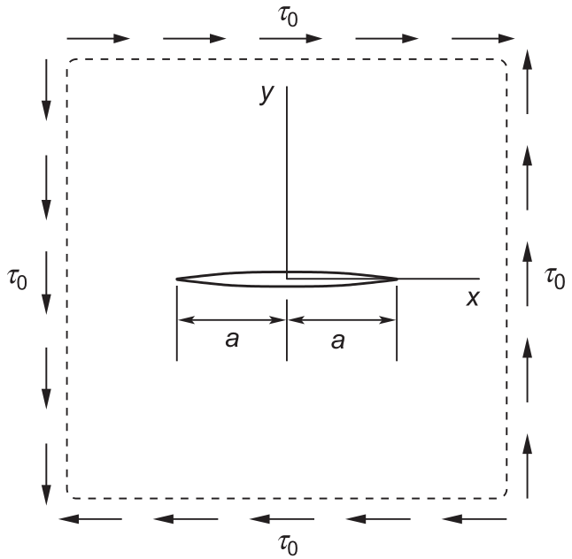
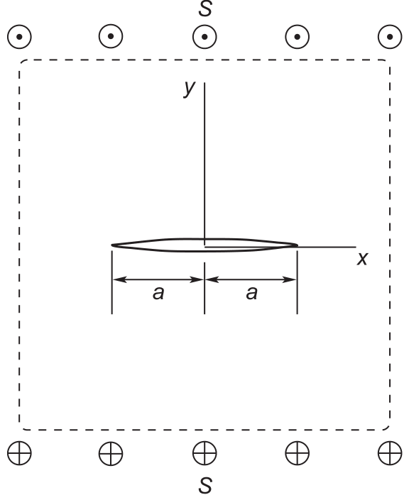

# AE837
## Advanced Mechanics of Damage Tolerance
Dr. Nicholas Smith 
Wichita State University, Department of Aerospace Engineering
September 5, 2019

----
## upcoming schedule

-		Sep 5 - Mode II and III Westergaard
-		Sep 10 - Stress Intensity Solutions
-   Sep 12 - Finite Size Effects, K-Dominance, HW 2 Due
-   Sep 17 - Fracture Criterion 

----
## outline

<!-- vim-markdown-toc GFM -->

* complex stress intensity
* westergaard mode ii
* westergaard mode iii

<!-- vim-markdown-toc -->

---
# complex stress intensity

----
## complex notation

-   it is often convenient to use complex notation to combine Modes I and II
-   <!-- .element style="list-style-type:none" --> $$K = K_I + iK_{II}$$
-   in terms of the Westergaard functions, we find
-   <!-- .element style="list-style-type:none" --> $$K \sqrt {2\pi} \lim_{z \to a} (\sqrt{z-a}(Z_I-iZ_{II}))$$

----
## mode iii

-   for mode iii we find, in terms of the westergaard function
-   <!-- .element style="list-style-type:none" --> $$ K_{III} = \sqrt{2\pi} \lim_{z \to a} (\sqrt{z-a}Z^\prime_{III}(z)) $$
-   a full derivation is found in Ch 3, pp 48-50

---
# westergaard mode ii

----
## mode ii

 <!-- .element width="50%" -->

----
## mode ii

-   Boundary conditions at the crack tip ($y=0$, $|x| < a $ ) are:
-   <!-- .element style="list-style-type:none" --> `$$\sigma_{xy} = \sigma_{yy} = 0$$`
-   Boundary conditions far away from the crack tip ($x^2 + y^2 \to \infty$) are:
-   <!-- .element style="list-style-type:none" --> `$$\sigma_{xx} = \sigma_{yy} = 0$$`
-   <!-- .element style="list-style-type:none" --> `$$\sigma_{xy} = \tau_0$$`

----
## mode ii

-   Consider the Westergaard function
-   <!-- .element style="list-style-type:none" --> `$$ Z_{II}(z) = \frac{\tau_0 z}{\sqrt{z^2-a^2}} $$`

----
## mode ii stress

-   We calculate stress terms from $Z_{II}$ as:
-   <!-- .element style="list-style-type:none" --> `$$\sigma_{xx} = 2 \text{Im} {Z_{II}} + y \text{Re} {Z_{II}^\prime}$$`
-   <!-- .element style="list-style-type:none" --> `$$\sigma_{yy} = -y \text{Re} {Z^\prime_{II}}$$`
-   <!-- .element style="list-style-type:none" --> `$$\sigma_{xy} = \text{Re}{Z_{II}} - y \text{Im}{Z^\prime_{II}}$$`

----
## mode ii displacement

-   And displacement as
-   <!-- .element style="list-style-type:none" --> `$$ 2 \mu u_x = \frac{1}{2} (\kappa + 1) \text{Im}{\hat{Z}_{II}} + y \text{Re}{Z_{II}} + \frac{\kappa+1}{2}By$$`
-   <!-- .element style="list-style-type:none" --> `$$ 2 \mu u_y = -\frac{1}{2} (\kappa -1) \text{Re}{\hat{Z}_{II}} - y \text{Im}{Z_{II}} - \frac{\kappa+1}{2}Bx$$`

----
## mode ii solution

-   For the Westergaard function we find a stress field of
-   <!-- .element style="list-style-type:none" --> `$$\sigma_{xx} = \frac{\tau_0 r}{\sqrt{r_1 r_2}} \left[ 2 \sin \left( \theta - \frac{1}{2} \theta_1 - \frac{1}{2} \theta_2 \right ) - \frac{a^2}{r_1}{r_2}\sin \theta \cos \frac{3}{2}(\theta_1 + \theta_2) \right ]$$`
-   <!-- .element style="list-style-type:none" --> `$$\sigma_{yy} = \frac{\tau_0 a^2 r}{(r_1 r_2)^{3/2}} \sin \theta \cos \frac{3}{2}(\theta_1 + \theta_2) $$`
-   <!-- .element style="list-style-type:none" --> `$$\sigma_{xy} = \frac{\tau_0 r}{\sqrt{r_1 r_2}} \left[ \cos \left( \theta - \frac{1}{2} \theta_1 - \frac{1}{2} \theta_2 \right ) - \frac{a^2}{r_1}{r_2}\sin \theta \sin \frac{3}{2}(\theta_1 + \theta_2) \right ]$$`

---
# westergaard mode iii

----
## antiplane

-   For antiplane problems, we can formulate in terms of displacement
-   <!-- .element style="list-style-type:none" --> `$$ u_x = u_y = 0 \qquad u_z = w(x,y) $$`
-   This yields the strains
-   <!-- .element style="list-style-type:none" --> `$$ e_{xz} = \frac{1}{2} \frac{\partial w}{\partial x} \qquad e_{yz} = \frac{1}{2}\frac{\partial w}{\partial y} $$`

----
## antiplane

-   The stresses can be found with Hooke's Law
-   <!-- .element style="list-style-type:none" --> `$$ \sigma_{xz} = 2\mu e_{xz} \qquad \sigma_{yz} = 2 \mu e_{yz} $$`
-   The equlibrium equations then reduce to
-   <!-- .element style="list-style-type:none" --> `$$ \frac{\partial \sigma_{xz}}{\partial x} + \frac{\partial \sigma_{yz}}{y} = 0 $$`
-   Which, in terms of displacement, reduces to $ \nabla^2 w = 0 $

----
## antiplane

-   Therefore $w$ must be a harmonic function, let
-   <!-- .element style="list-style-type:none" --> `$$ w = \frac{1}{\mu} \text{Im}{Z_{III}(z)}$$`
-   This gives the stresses as
-   <!-- .element style="list-style-type:none" --> `$$ \sigma_{xz} - i \sigma_{yz} = -iZ^\prime_{III}(z)$$`

----
## mode iii

 <!-- .element width="40%" -->

----
## mode iii

-   The boundary conditions for a Mode III crack are
-   <!-- .element style="list-style-type:none" -->`$$ \sigma_{yz} = 0 \qquad \text{at} \qquad |x| < a| \text{ and } y = 0 $$`
-   <!-- .element style="list-style-type:none" -->`$$ \sigma_{yz} = S \qquad \text{at} \qquad |y| \to \infty $$`

----
## mode iii

-   We choose
-   <!-- .element style="list-style-type:none" --> `$$ Z_{III} = S\sqrt{z^2 - a^2} $$`
-   and find
-   <!-- .element style="list-style-type:none" --> `$$ \sigma_{yz} = \frac{Sr}{\sqrt{r_1 r_2}} \cos \left( \theta - \frac{1}{2} \theta_1 - \frac{1}{2} \theta_2 \right ) $$`
-   <!-- .element style="list-style-type:none" --> `$$ \sigma_{xz} = \frac{Sr}{\sqrt{r_1 r_2}} \sin \left( \theta - \frac{1}{2} \theta_1 - \frac{1}{2} \theta_2 \right ) $$`
