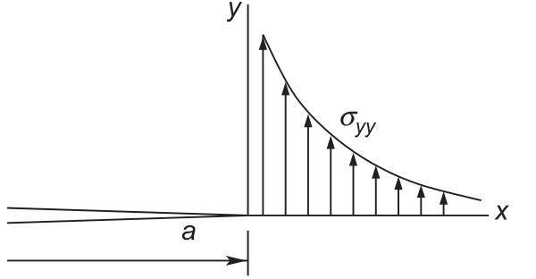
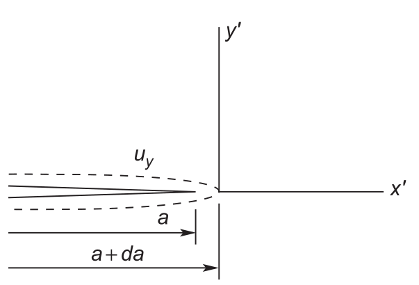
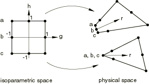

# AE837
## Advanced Mechanics of Damage Tolerance
Dr. Nicholas Smith 
Wichita State University, Department of Aerospace Engineering
September 26, 2019

----
## upcoming schedule

-   Sep 26 - Exam return, Direct Method
-   Oct 1 - Virtual Crack Closure, J-integral
-   Oct 3 - J-Integral, Cohesive Zone
-   Oct 8 - eXtended Finite Element Method
-   Oct 10 - XFEM, Homework 4 Due

----
## outline

<!-- vim-markdown-toc GFM -->

* exam
* crack closure
* direct method in finite elements

<!-- vim-markdown-toc -->

---
# exam

----
## results

-   High score was 93, curved scores by adding 7 (check my math)
-   Traction boundary conditions
-   Physical meaning of integrals

---
# crack closure

----
## crack closure

-   We have discussed that $G_I$ and $K_I$ are related for perfectly elastic materials
-   We will use the crack closure method to find this relationship

----
## crack closure

	

	

----
## crack closure

-   The stress field ahead of the crack tip is given by

$$ \sigma_{yy} = \frac{K_I(a)}{\sqrt{2\pi x}} $$

-   And the displacement field at the former crack tip after some extension $da$ is

$$ u_y = \frac{\kappa + 1}{4\mu \pi} K_I \sqrt{2 \pi (da-x)} $$

----
## crack closure

-   If we consider a very small $da$, then we can consider that $K_I$ in both cases is equivalent
-   The strain energy associated with crack extension can be thought of as the work done by $\sigma_{yy}$ to move $u_y$
-   This must also be equal to the strain energy released, $G_I da$

$$ G_I da = \int_0^{da} \sigma_{yy} u_y dx $$

----
## crack closure

-   After substituting what we have already shown for $\sigma_{yy}$ and $u_y$ we find

$$ G_I da = \frac{\kappa + 1}{4 \mu \pi} K_I^2 \int_0^da \sqrt{\frac{1-x/a}{x/da}} $$

-   After some integration tricks, we find

$$ G_I = \frac{\kappa + 1}{8\mu}K_I^2 $$

----
## kappa

-   The parameter $kappa$ helps convert between plane strain and plane stress
-   In plane strain, $\kappa = 3 - 4\nu$
-   In plane stress, $\kappa = (3-\nu)/(1+\nu)$

---
# direct method in finite elements

----
## direct method

-   As we discussed previously, since we know both $\sigma_{yy}$ and $u_y$ as functions of $K_I$, we should be able to use those in finite element analysis to find $K_I$

$$ \begin{aligned}
	\sigma_{yy} &= \frac{K_I}{\sqrt{2\pi x}}\\
	u_y &= \frac{K_I(\kappa+1)}{4 \mu \pi} \sqrt{2 \pi x}
\end{aligned}$$

----
## direct method

-   This results in 

$$ \begin{aligned}
	K_I &= \sigma_{yy}\sqrt{2\pi x}\\
	K_I &= \frac{2\mu u_y}{\kappa + 1} \frac{2\pi x}{x}
\end{aligned}$$

----
## accuracy

-   This method will only be accurate in the K-dominance zone (it ignores non-singular stress)
-   Needs a very fine mesh or $1/\sqrt{r}$ singularity elements

