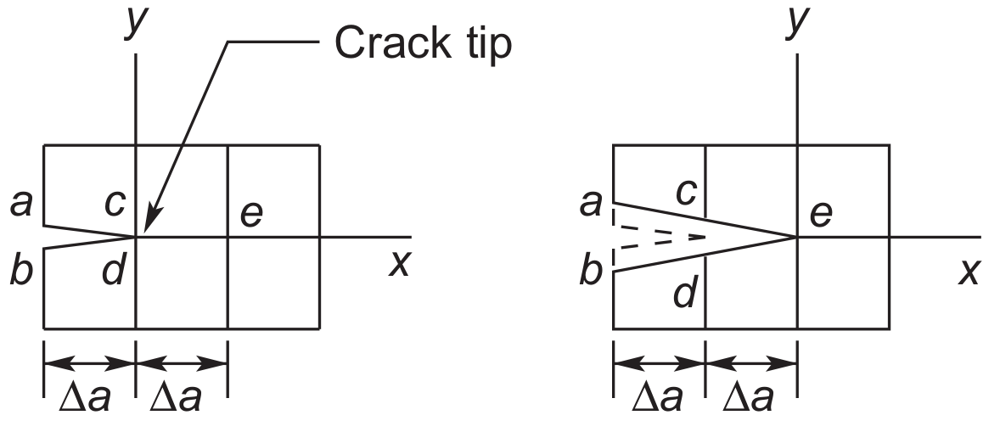

# AE837
## Advanced Mechanics of Damage Tolerance
Dr. Nicholas Smith 
Wichita State University, Department of Aerospace Engineering
October 1, 2019

----
## upcoming schedule

-   Oct 1 - Virtual Crack Closure, J-integral
-   Oct 3 - J-Integral, Cohesive Zone
-   Oct 8 - eXtended Finite Element Method (XFEM)
-   Oct 10 - XFEM, Homework 4 Due
-   Oct 15 - Fall Break (no class)

----
## outline

<!-- vim-markdown-toc GFM -->

* comsol setup
* finite element demo
* virtual crack closure
* j-integral

<!-- vim-markdown-toc -->

---
# comsol setup

----
## comsol install

-   I need your computer's "hostname" to whitelist you
-   You can download COMSOL [here](https://drive.google.com/open?id=1IT4IlM9j0nTDVDE9L8QhhhpKa7RXEjyw)
-   To run COMSOL, you either need to be on campus or you need to use a [VPN](https://vpn.wichita.edu) (to have an on-campus IP address)
-   When installing, choose "License Format -> port number @ hostname"
	-   port number 1718
	-   aecomsol.wichita.edu as hostname

----
## comsol tutorials

-   If you have not used COMSOL before, they have a pretty good library of tutorials
-   For example, to see how they perform the J-integral you can follow [this](https://www.comsol.com/model/single-edge-crack-988) tutorial
-   The [application gallery](https://www.comsol.com/models) has many more documented examples you can follow along with

---
# finite element demo

----
## objectives

-   We will use the direct method to find the stress intensity factor, $K_I$, of an edge crack
-   The analytic solution is

$$ K_I = (1.122 - 0.231 \frac{a}{W} + 10.55 \left(\frac{a}{W}\right)^2 - 21.71 \left(\frac{a}{W}\right)^3)\sigma \sqrt{\pi a} $$

-   And $K_I$ in terms of stress and displacement is

$$ \begin{aligned}
	K_I &= \sigma_{yy}\sqrt{2\pi x}\\\\
	K_I &= \frac{2\mu u_y}{\kappa + 1} \sqrt{\frac{2\pi}{x}}
\end{aligned}$$

----
## boundary conditions

-   The first thing to consider is symmetry
-   It is easiest to cut our model in half vertically and treat it as symmetric
-   If we don't do this, we need a way of cutting the nodes where the crack is (or joining them where it isn't)
-   For an edge crack, we will have a symmetry condition on the symmetric portion and a boundary load on top, otherwise everything else is traction free

----
## screencast

<section>
	<video controls id="directmethod" src="../images/direct-method.mp4" type="video/mp4" style="height: 50%; width: 50%;" />
</section>

---
# virtual crack closure

----
## vcct

-   As can be seen from the results previously found, the direct method leaves something to be desired, and is very mesh-dependent
-   An alternative approach is to use the same energy method (virtual crack closure) that we used to relate $G_I$ to $K_I$ in finite elements
-   We consider two cases, one before and one after some crack extension, $da$

----
## vcct illustration

----
## vcct

-   Since this is an energy approach, we will be directly finding $G_I$, but for elastic materials we can easily convert this to $K_I$

$$ G_I = \frac{1}{2 da} F_y^{(c)}\left( u_y^{(c)} - u_y^{(d)}\right ) $$

-   Where the force at $c$ is taken before extension (or after closure) and the displacement is taken after extension (or before closure)

----
## modified version

-   It is a little bit cumbersome to work with two finite element solutions for some $da$
-   It has been shown that with no loss of accuracy, for small $da$ ($da/a \le 0.05$), we can use the nodes right in front of and behind the crack tip, eliminating the need for a two-step model
-   Note: for this method to work, the mesh near the crack tip must be uniform

----
## demo

-   We will add to the previous model, however in this case we need to partition the line of symmetry a second time to enforce a uniform mesh both directions around the crack tip
-   To compare $G_I$ and $K_I$ we will want to convert one or the other, since we had found $K_I$ previously, we will convert $G_I$ to $K_I$

$$ \begin{aligned}
	K_I &= \sqrt{\frac{E G_I}{1-\nu^2}} \qquad \text{plane strain}\\\\
	K_I &= \sqrt{E G_I} \qquad \text{plane stress}
\end{aligned} $$

----
## screencast

---
# j-integral

----
## j-integral

-   The J-Integral is defined as

$$ \int_\Lambda \left( W dy - T_i \frac{\partial u_i}{\partial x} d\Lambda \right ) = \int_\Lambda \left( W n_1 - \sigma_{ij} \frac{\partial u_i}{\partial x} n_j \right ) d\Lambda $$

-   \Lambda is an arbitrary contour beginning at the lower crack surface and end on the upper crack surface

----
## j-integral

----
## j-integral

-   The J-integral is path-idependent and represents the strain energy release rate
-   We can prove this using the following principles from elasticity

$$ \begin{aligned}
	\sigma_{ij,j} &= 0 \qquad \text{(equilibrium)} \\\\
	e_{ij} &= \frac{1}{2} (u_{i,j} + u_{j,i}) \qquad \text{(strain-displacement)} \\\\
	\sigma_{ij} &= \frac{\partial W}{\partial e_{ij}} \qquad \text{(stress-strain)}
\end{aligned}$$

----
## j-integral

----
## j-integral

-   $A_0$ represents the area enclosed by the contour
-   The potential energy can then be expressed as

$$ \iint_{A_0} W dX dY - \int_{\Lambda_t} T_i u_i d\Lambda $$

-   (worked on board)

----
## examples

