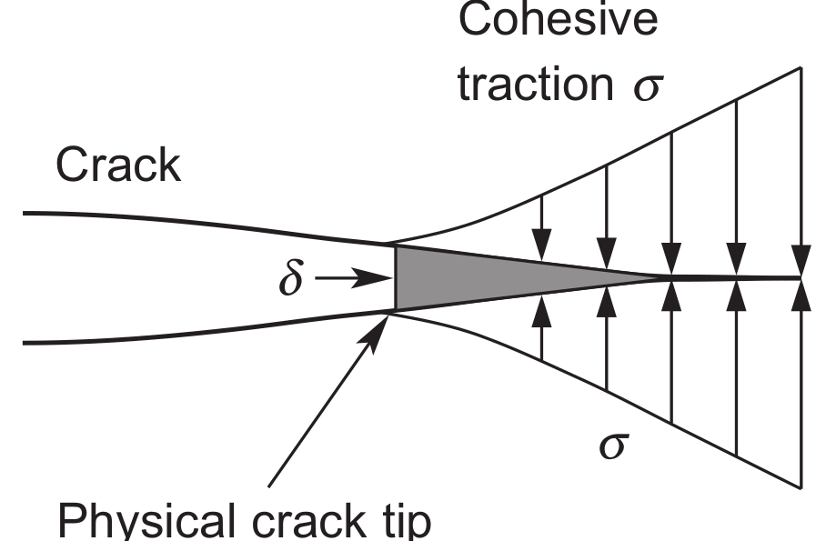
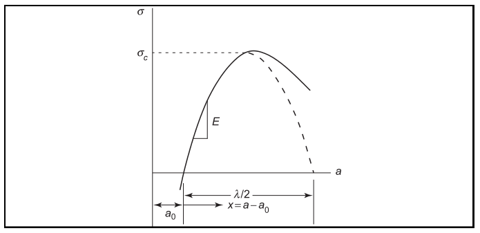
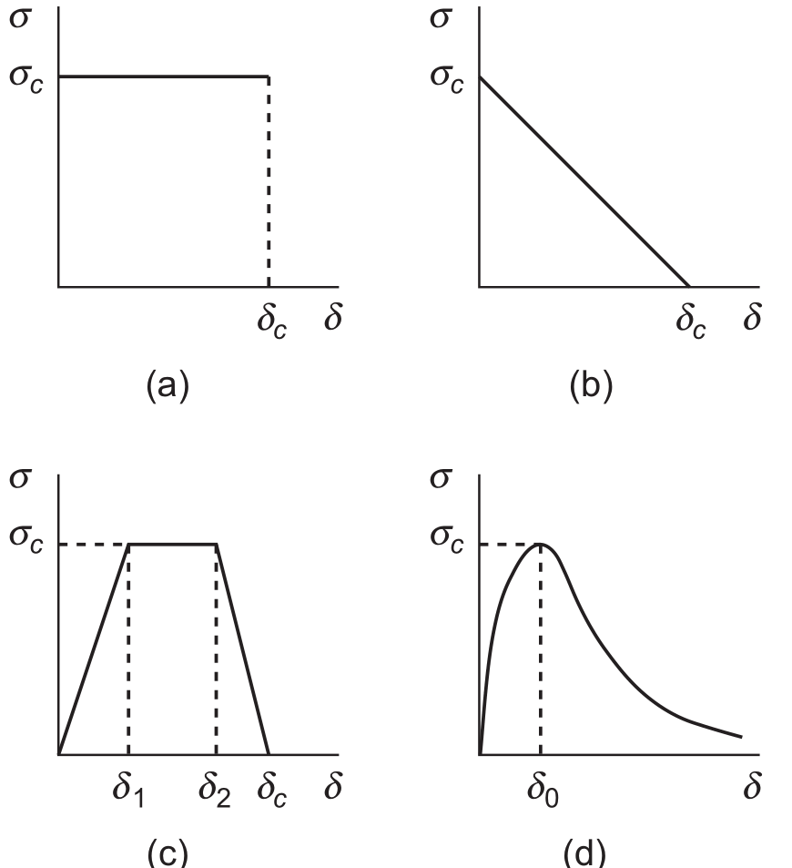
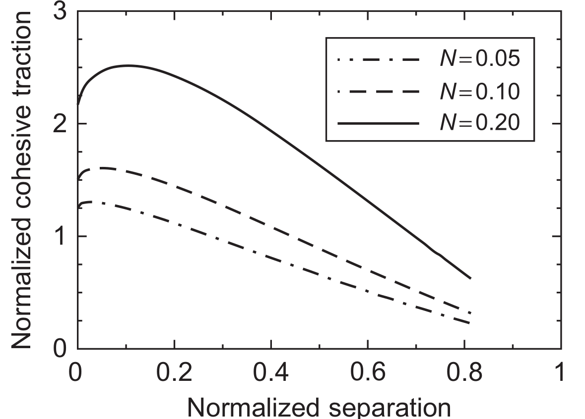

 # AE837
## Advanced Mechanics of Damage Tolerance
Dr. Nicholas Smith 
Wichita State University, Department of Aerospace Engineering
October 10, 2019

----
## upcoming schedule

-   Oct 10 - Cohesive Zone
-   Oct 15 - Fall Break (no class)
-   Oct 17 - XFEM, Homework 4 & 5 Due
-   Oct 22 - XFEM
-   Oct 24 - Mixed-Mode Fracture, Project Abstract Due

----
## outline
 
<!-- vim-markdown-toc GFM -->

* final project
* cohesive zone
* mixed mode cohesive law

<!-- vim-markdown-toc -->

---
# final project

----
## final project

-   Model crack propagation in some real-life object
-   Can be anything, including work you find in a literature review
-   Abstract due Oct 24

----
## rubric

-   Abstract	-   5%
-   Analytic Model	-   20%
-   Justification for Numerical Method	-   20%
-   Propagation Model		-   25%
-   Conclusions		-   15%
-   General presentation	-   15%

----
## abstract

-   1-2 pages describing your idea for a project and why it will satisfy the requirements
-   Think about a real crack propagation problem and what assumptions you might need to make to model it
-   How will this project demonstrate your understanding of this material?

----
## analytic model

-   Use methods described in class, as well as possibly some simplifying geometric assumptions, to model the strain energy release rate and/or the stress intensity factor
-   You can use this as a check on your finite element model to make sure you have set up your boundary conditions correctly

----
## justification

-   We have (and will) discussed several different numerical techniques for crack propagation
-   Justify why the method you have chosen is the best approach for your problem

----
## propagation model

-   You are not required to turn in the actual model with your project
-   Instead, you will interpret the results and portray them in a report

----
## conclusions

-   You should interpret the results from your model and make some conclusions
-   What have you learned about crack propagation in this problem as a result of your work?
-   Do you have any recommendations to improve this model or to improve this object?

----
## general presentation

-   Organization
-   Consistent formatting
-   Spelling/grammar

---
# cohesive zone

----
## cohesive zone

-   Linear Elastic Fracture Mechanics is built on the continuum assumption
-   This is appropriate at large scales, but inaccurate near the atomic scale
-   As we consider the atomic scale, the concept of a stress singularity does not make sense
-   The cohesive zone model was proposed to treat this

----
## cohesive zone

-   There exists a zone near the crack tip held together by cohesive traction
-   The size of the cohesive zone and magnitude of the cohesive traction are independent of geometry and external loads
-   Stresses are finite everywhere, including the crack tip

----
## cohesive zone

 <!-- .element width="60%" -->

----
## cohesive zone

----
## failure models

-   We can represent various failure models by incorporating different behavior in the traction-separation law
-   Dugdale model for ductile materials
-   Linear softening model for quasi-brittle materials (concrete and ceramics)
-   Trapezoidal model combines both
-   Expenonential form (based on atomic failure theory)

----
## failure models

 <!-- .element width="40%" -->

----
## necking

 <!-- .element width="60%" -->

---
# mixed mode cohesive law

----
## mixed-mode cohesive law

-   Cohesive zones are often used to model an adhesive bond between two dissimilar interfaces
-   Interfacial fraction is inherently mixed-mode due to the different material properties across the interface
-   Therefore we must describe a cohesive law for mixed-mode conditions

----
## mixed-mode cohesive law

-   If we consider a cohesive traction with both normal and shear components, $\sigma_n$ and $\sigma_s$
-   And also normal and shear components of separation, $\delta_n$ and $\delta_s$
-   We can define an effective traction and separation in terms of some parameter $\eta$

----
## mixed-mode cohesive law

$$\begin{aligned}
	\sigma_{eff} &= \sqrt{\sigma_n^2 + \eta^{-2}\sigma-s^2}\\\\
	\delta_{eff} &= \sqrt{\delta_n^2 + \eta^2 \delta_s^2}
\end{aligned}$$
