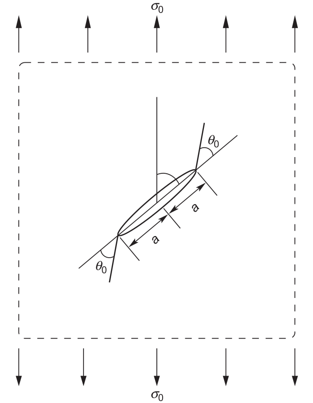
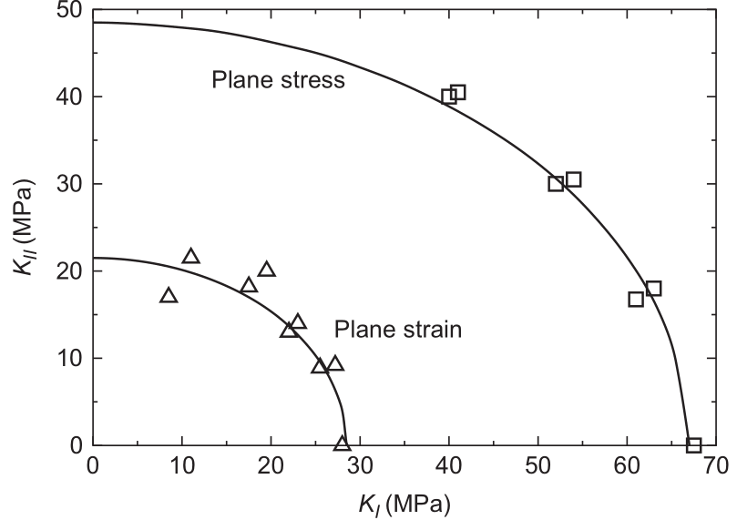

# AE837
## Advanced Mechanics of Damage Tolerance
Dr. Nicholas Smith 
Wichita State University, Department of Aerospace Engineering
October 17, 2019

----
## upcoming schedule

-   Oct 17 - Mixed-Mode Fracture, Homework 4 & 5 Due
-   Oct 22 - XFEM
-   Oct 24 - XFEM, Project Abstract Due
-   Oct 29 - Crack Tip Plasticity

----
## outline
 
<!-- vim-markdown-toc GFM -->

* elliptical model
* maximum stress criterion
* strain energy criterion
* energy release rate criterion
* experimental work

<!-- vim-markdown-toc -->

---
# elliptical model

----
## simple approach

-   Some of the first work on mixed-mode fracture used a phenomenological approach
-   We know that fracture occurs when $K_I = K_{Ic}$ or $G_I = G_{Ic}$
-   We might assume some function of either $K_I$ and $K_{II}$ or $G_{I}$ and $G_{II}$ would cause fracture upon reaching some critical value

----
## total energy release rate

-   The total energy release rate was first suggested for this purpose with

$$ G = \frac{\kappa+1}{8\mu}(K_I^2 + K_{II}^2) $$

-   Rearranging terms and making some substitutions gives the following, which we can see is the equation of a circle in the $K_I - K_{II}$ plane

$$ \left( \frac{K_I}{K_{c}} \right)^2 + \left( \frac{K_II}{K_c} \right)^2 = 1 $$

----
## results

-   While the total energy release method makes some physical sense, it does not match experiments
-   It would predict $K_{IC} = K_{IIC}$, which is not the case
-   Instead we can modify the equation to an ellipse in the $K_I - K_{II}$ plane

$$ \left( \frac{K_I}{K_{Ic}} \right)^2 + \left( \frac{K_II}{K_{IIc}} \right)^2 = 1 $$

----
## oblique tests

----
## test results

----
## summary

-   The elliptical method can do a good job predicting mixed-mode fracture loads
-   Cannot predict the direction a crack will grow
-   Requires characterization of both $K_{Ic}$ and $K_{IIc}$

---
# maximum stress criterion

----
## ms-criterion

-   The maximum tensile stress criterion is also called the MS-Criterion
-   Assumes crack will extend in direction where the circumferential stress, $\sigma_{\theta \theta}$ is maximum
-   Also predicts crack will grow when $K_I$ in this direction exceeds $K_c$

----
## stress field

-   In polar coordinates, the near-tip stress field for $\sigma_{\theta \theta}$ and $\sigma_{r\theta}$ are

$$ \begin{aligned}
	\sigma_{\theta \theta} &= \frac{1}{\sqrt{2 \pi r}} \cos \frac{\theta}{2} \left[ K_I \cos^2 \frac{\theta}{2} - \frac{3}{2} K_{II} \sin \theta \right] \\\\
	\sigma_{r \theta} &= \frac{1}{\sqrt{2 \pi r}} \cos \frac{\theta}{2} \left[\frac{1}{2} K_I \sin \theta + \frac{1}{2} K_{II} (3\cos \theta - 1) \right] 
\end{aligned} $$

----
## max stress

-   We find that the maximum hoop stress occurs when the shear stress is 0, hence we need

$$ \frac{1}{\sqrt{2 \pi r}} \cos \frac{\theta}{2} \left[\frac{1}{2} K_I \sin \theta + \frac{1}{2} K_{II} (3\cos \theta - 1) \right] = 0 $$

-   Which gives

$$ \cos \frac{\theta}{2} = 0 $$

or

$$ K_1 \sin \theta + K_{II} (3 \cos \theta - 1) = 0 $$

----
## max stress

-   The first equation corresponds to when $\sigma_{\theta \theta} = 0$, hence we solve the second to find the fracture angle

----
## critical stress

-   The ms-criterion assumes critical stress occurs when 

$$ \sigma_{\theta \theta} = \frac{K_{IC}}{\sqrt{2\pi r}} $$

---
# strain energy criterion

----
## s-criterion

-   The fundamental assumptions of the strain energy density criterion (s-criterion) are
-   The crack will extend in the direction of minimum strain energy density
-   Crack extension occurs when the minimum strain energy reaches some critical value $S_{min} = S_{cr}$

---
# energy release rate criterion

---
# experimental work
