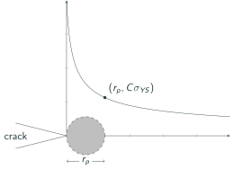
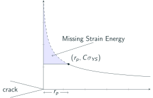
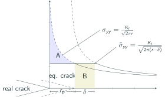

# AE837
## Advanced Mechanics of Damage Tolerance
Dr. Nicholas Smith 
Wichita State University, Department of Aerospace Engineering
October 29, 2019

----
## upcoming schedule

-   Oct 29 - Crack Tip Plasticity
-   Oct 31 - Crack Tip Plasticity, Homework 6 Due
-   Nov 5 - Exam 2 Review
-   Nov 7 - Exam 2, Homework 7 Due

----
## outline
 
<!-- vim-markdown-toc GFM -->

* yield theory
* constitutive relationship
* irwin's model

<!-- vim-markdown-toc -->

---
# yield theory

----
## plasticity

-   We know that no real materials are perfectly elastic
-   We desire to extend our LEFM-based fracture models to the case where there is some plasticity
-   We start by reviewing two common plasticity theories

----
## tresca

-   Tresca yield theory assumes that all yielding is caused by pure shear
-   The maximum shear stress can be expressed in terms of the principal stresses

$$ \begin{aligned}
\tau_1 &= \frac{1}{2} |\sigma_2-\sigma_3| \\\\
\tau_2 &= \frac{1}{2} |\sigma_1-\sigma_3| \\\\
\tau_3 &= \frac{1}{2} |\sigma_1-\sigma_2| 
\end{aligned} $$

----
## von mises

-   von Mises yield criterion assumes yielding is a result of distortional deformation only
-   If we consider the strain energy, $W = \frac{1}{2} \sigma_{ij}\epsilon_{ij}$
-   We can expand this in terms of the principal stresses to find

$$ W = \frac{1}{12\mu} \left[ (\sigma_1-\sigma_2)^2 + (\sigma_2-\sigma_3)^2 + (\sigma_1-\sigma_3)^2\right ] + \frac{1}{18K}(\sigma_1 + \sigma_2 + \sigma_3)^2$$

----
## von mises

-   The first term is the distortional strain energy, while the second term is the dilatational strain energy (energy related to volume change)
-   If we neglect the second term, we find the von Mises expression for critical strain energy

$$ W = \frac{1}{12\mu} \left[ (\sigma_1-\sigma_2)^2 + (\sigma_2-\sigma_3)^2 + (\sigma_1-\sigma_3)^2\right ] $$

---
# constitutive relationship

----
## flow theory

-   For elastic materials we can write Hooke's Law as

$$ \sigma_{ij} = \lambda e_{kk} \delta_{ij} + 2\mu e_{ij} $$

-   However when plasticity is involved, the current relationship between stress and strain depends on the strain history
-   Incremental theories of plasticity are often referred to as "flow" plasticity

----
## flow theory

-   For most metals the volumetric strain does not affect yield, thus we can consider the deviatoric portion

$$ \sigma_{ij}^\prime = \sigma_{ij} - \frac{1}{3} \sigma_{kk}\delta_{ij} $$

----
## flow theory

-   In flow theory, stresses are related to strain increments, which can be split into elastic and plastic components

$$ d e_{ij} = d e_{ij}^e + d e_{ij}^p $$

-   The elastic portion can be taken from Hooke's Law, the plastic portion is derived from a plastic potential

$$ d e_{ij}^p = d\lambda \frac{\partial f}{\partial \sigma_{ij}} $$

----
## plastic potential

-   The plastic potential is often taken as the yield function
-   For von Mises, we can write the function in the following form

$$ J_2 - \frac{1}{3}\sigma_Y^2 = 0 $$

-   Where $J_2 = \frac{1}{2}\sigma_{ij}^\prime \sigma_{ij}^\prime$
-   This is known as $J_2$ flow theory

---
# irwin's model

----
## first approximation

-   If we recall the equation for opening stress (`$\sigma_y$`) near the crack tip

$$\\sigma\_y = \\frac{K\_I}{\\sqrt{2\\pi r}} \\cos \\frac{\\theta}{2} \\left(1+\\sin \\frac{\\theta}{2}\\sin \\frac{3\\theta}{2}\\right) $$

-   In the plane of the crack, when `$\theta=0$` we find

$$\\sigma\_y = \\frac{K\_I}{\\sqrt{2\\pi r}}$$

----
## first approximation

<!-- .element width="50%" -->

----
## first approximation

<ul>
<li> We use *C*, the *Plastic Constraint Factor* to convert between Plane Strain and Plane Stress solutions</li>
<li> The plastic zone size can now be approximated</li>

$$\\begin{aligned}
  \\sigma\_{yy}(r=r\_p) &= C\\sigma\_{YS}\\\\
  \\frac{K\_I}{\\sqrt{2\\pi r\_p}} &= C\\sigma\_{YS}\\\\
  r\_p &= \\frac{1}{2\\pi} \\left(\\frac{K\_I}{C\\sigma\_{YS}}\\right)^2
\\end{aligned}$$

----
## first approximation

-   For plane stress (thin panels) we let $C=1$ and find *r**p* as

$$r\_p = \\frac{1}{2\\pi} \\left(\\frac{K\_I}{\\sigma\_{YS}}\\right)^2$$

-   And for plane strain (thick panels) we let $C=\\sqrt{3}$ and find

$$r\_p = \\frac{1}{6\\pi} \\left(\\frac{K\_I}{\\sigma\_{YS}}\\right)^2$$

----
## intermediate panels

-   For panels which lie between plane strain and plane stress states, we use the following expression to estimate the plastic zone size

$$r\_p = \\frac{1}{I\\pi} \\left(\\frac{K\_I}{\\sigma\_{YS}}\\right)^2$$

-   Where *I* is defined as

$$I = 6.7 - \\frac{1.5}{t}\\left(\\frac{K\_I}{\\sigma\_{YS}}\\right)^2$$

-   And `$2 \le I \le 6$`

----
## second approximation

-   If our material is perfectly elastic-plastic, no stresses above $C\sigma_{ys}$ will exist in the material
-   This ignores the strain energy (represented by the area under the curve) in the plastic zone

----
## second approximation

<!-- .element width="50%" -->

----
## second approximation

-   To account for the additional strain energy, Irwin considered a plastic zone size increased by some $\delta$
-   He also needed to adjust the stress function, and considered an equivalent crack tip in these calculations

----
## second approximation

<!-- .element width="50%" -->

----
## Irwin's second approximation

We need *A*=*B*, so we set them equivalent and solve for $\delta$.

$$\\begin{aligned}
  A &= \\int\_{0}^{r\_p} \\sigma\_{yy} dr - r\_p \\sigma\_{YS}\\\\
  &= \\int\_{0}^{r\_p} \\frac{K\_I}{\\sqrt{2\\pi r}} dr - r\_p \\sigma\_{YS}\\\\
  &= \\frac{K\_I}{\\sqrt{2\\pi}}\\int\_{0}^{r\_p} r^{-1/2} dr - r\_p \\sigma\_{YS}\\\\
  &= \\frac{2K\_I \\sqrt{r\_p}}{\\sqrt{2\\pi}}- r\_p \\sigma\_{YS}
\\end{aligned}$$

----
## second approximation

-   We have already found *r**p* as

$$r\_p = \\frac{1}{2\\pi} \\left(\\frac{K\_I}{\\sigma\_{YS}}\\right)^2$$

-   If we solve this for *K**I* we find

$$K\_I = \\sqrt{2\\pi r\_p} \\sigma\_{YS}$$

----
## second approximation

-   We can now substitute back into the strain energy of A

$$\\begin{aligned}
  A &= \\frac{2\\sqrt{2\\pi r\_p} \\sigma\_{YS} \\sqrt{r\_p}}{\\sqrt{2\\pi}}- r\_p \\sigma\_{YS}\\\\
  &= 2 \\sigma\_{YS} r\_p- r\_p \\sigma\_{YS}\\\\
  &= r\_p \\sigma\_{YS}
\\end{aligned}$$

----
## second approximation

-   B is given simply as `$B=\delta \sigma_{ys}$` so we equate A and B to find $\delta$

$$\\begin{aligned}
  A &= B\\\\
  r\_p \\sigma\_{YS} &= \\delta \\sigma\_{YS}\\\\
  r\_p &= \\delta
\\end{aligned}$$

----
## second approximation

-   This means the plastic zone size is simply 2*r**p*
-   However, it also means that the effective crack length is *a*+*r**p*
-   Since *r**p* depends on *K**I*, we must iterate a bit to find the "real" *r**p* and *K**I*

----
## crack tip opening displacement

-   According to Irwin's model, the physical crack tip is on the elastic-plastic boundary
-   Thus the displacement field is

$$ 2 u_y = \frac{8K_I}{E^*}\sqrt{\frac{r}{2\pi}} $$

-   The crack tip opening displacement is defined as $\delta = 2u_y |_{r=r_p}$ and thus

$$ \delta = \frac{4}{\pi E^*}\frac{K_I^2}{\sigma_Y^*} $$
