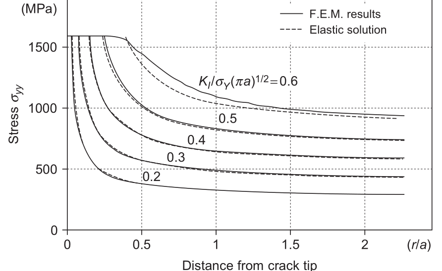
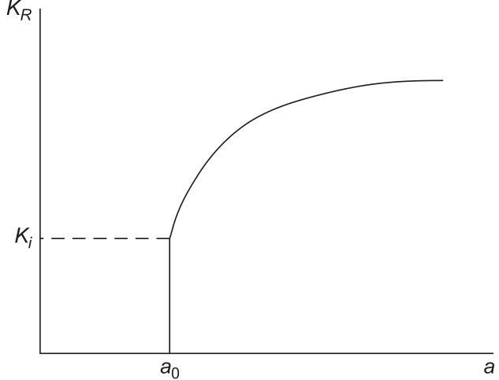
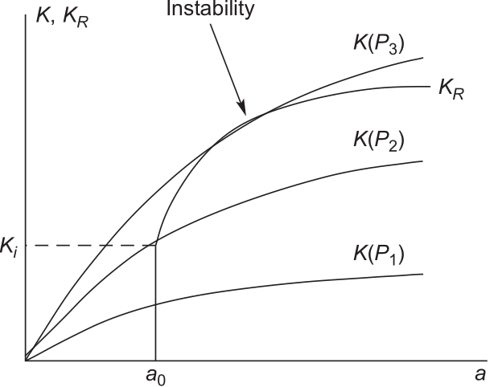
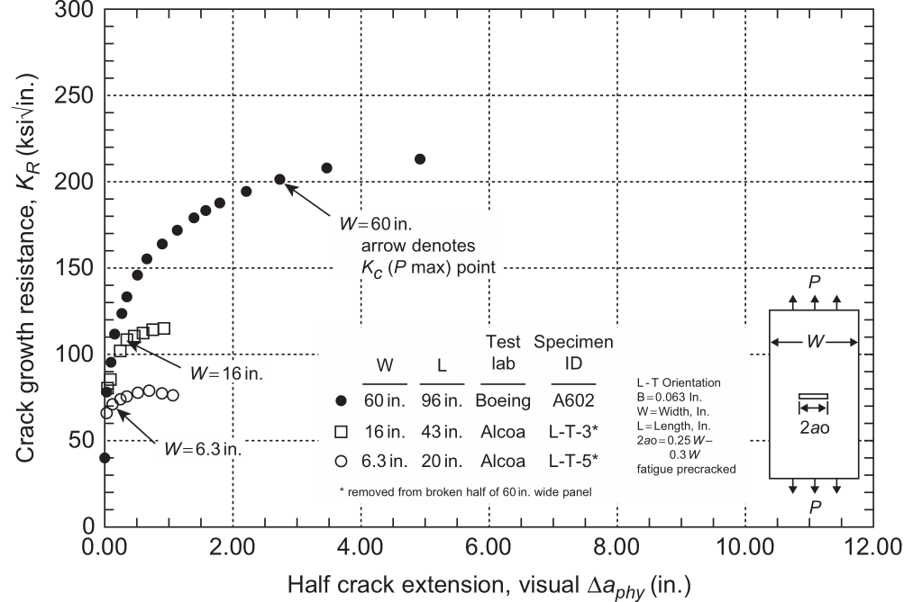
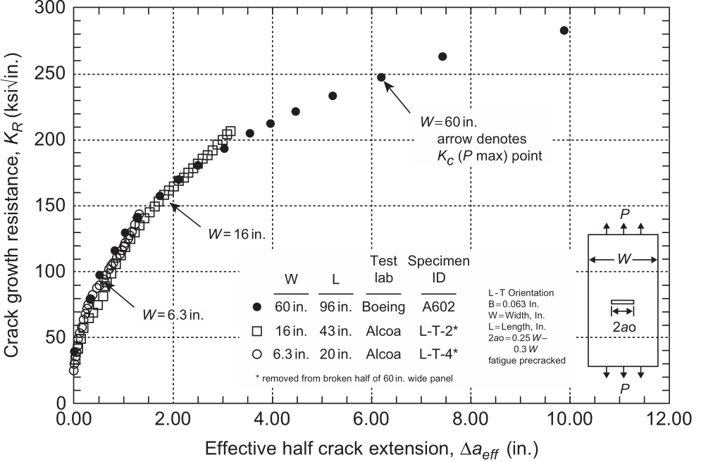
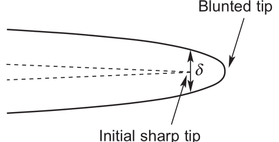
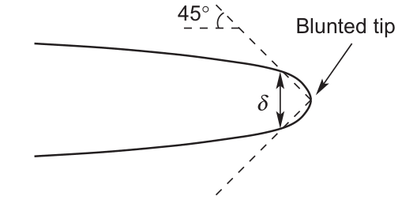
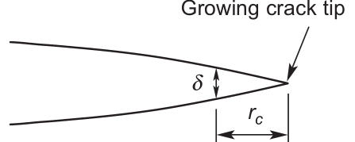

# AE837
## Advanced Mechanics of Damage Tolerance
Dr. Nicholas Smith 
Wichita State University, Department of Aerospace Engineering
October 31, 2019

----
## upcoming schedule

-   Oct 31 - Crack Tip Plasticity, Homework 6 Due
-   Nov 5 - Exam 2 Review
-   Nov 7 - FE Demo?, Homework 7 Due
-   Nov 12 - Exam 2

----
## outline
 
<!-- vim-markdown-toc GFM -->

* adjusted stress intensity
* resistance curve
* j integral
* crack tip displacement
* crack tip angle

<!-- vim-markdown-toc -->

---
# adjusted stress intensity

----
## adjusted stress intensity

-   Irwin's approach to predicting fracture in plastic materials is to simply use the adjusted stress intensity factor
-   Thus fracture would occur when $K_I (a_{eff}) = K_c$

----
## irwin stress field

---
# resistance curve

----
## resistance curve

-   The Irwin approach is good for small and moderate scale yielding, but thin materials with much larger plastic zones are not described well by this approach
-   In these materials we look at the resistance (or $K_R$) curve
-   This is like an adapted version of a stress-strain curve for a cracked panel
-   Plots stress intensity factor vs. crack length for a test

----
## resistance curve

----
## failure

-   To determine fracture from the resistance curve we need to look at not just the stress intensity at the current crack length, but also its slope
-   We can do this visually by comparing some stress intensity factors at constant load to the $K_R$ curve

----
## failure

----
## effective crack

-   We need to be sure to use the effective crack length
-   Difference can be significant for thin materials (where $K_R$ curve is often most useful)

----
## physical crack

----
## effective crack

---
# j integral

----
## j integral

-   Since the J-integral can be used for plastic materials as well, it is an attractive idea for a failure criteria
-   $J = J_c$ would mark failure
-   Unfortunately, under large scale yielding this is limited to some specific cases

---
# crack tip displacement

----
## crack tip opening displacement

-   under large scale yielding, it is difficult to find a single parameter (like $K_I$) which can characterize the intensity of a crack tip for both stationary and crowing cracks
-   the $K_R$ curve is only valid when the plastic zone does not touch the end of the specimen
-   J-integral is only for stationary cracks

----
## ctod

-   It has been proposed that the displacement near the crack tip could describe fracture behavior and reflects the overall severity of plastic deformation
-   crack initiation occurs when $\delta = \delta_c$
-   one difficulty is in defining exactly where the crack tip opening displacement occurs

----
## ctod

----
## ctod

-   In practice, two approaches are often used
-   The 45 degree rule is used for static cracks, where a 45 degree line is taken from the center of the blunted crack tip and where it intersects is the point to measure displacement
-   For growing cracks, a "characteristic distance" is used instead

----
## 45 degree

----
## characteristic distance

---
# crack tip angle

----
## crack tip opening angle

-   Theoretically, the crack tip opening angle is defined as the angle between crack faces at the crack tip
-   This presents practical challenges for cracks that are not perfectly straight, in which case the angle is averaged
-   However, it is a popular approach currently for fracture in ductile materials
